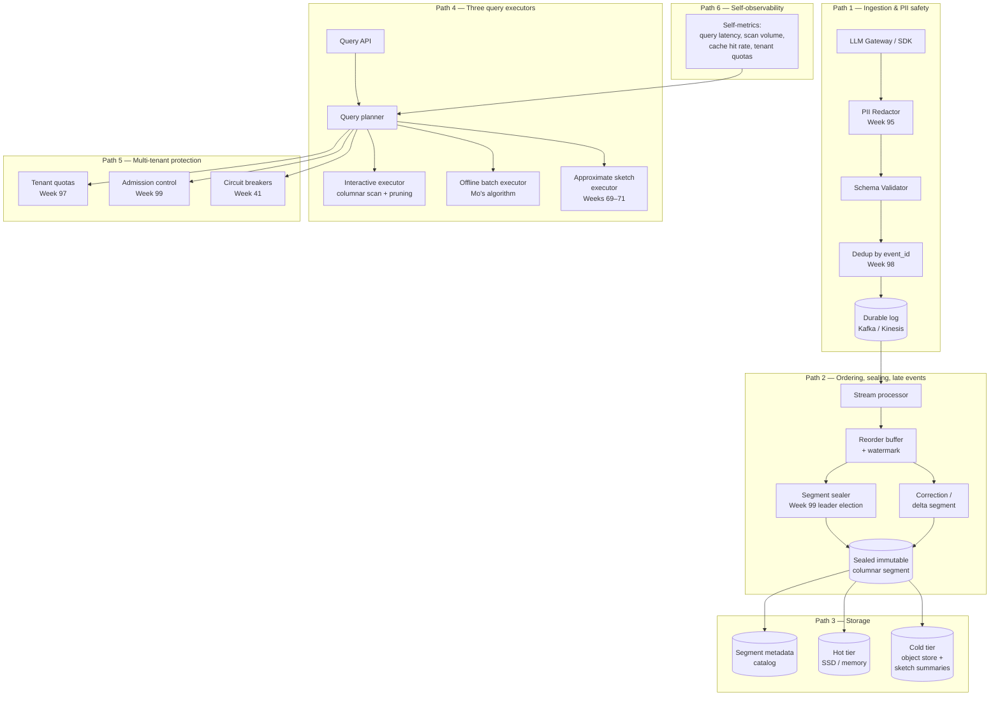

# Capstone — Multi-Tenant LLM Trace Forensics with Mo's Algorithm

> A staff-level system design + coding capstone for the **108-Week AI Engineering, ML Systems & Interview Mastery Course**.
> Use it as your **final portfolio artifact** (Phase 10, Weeks 103–108) and as an interview drill in the final month of the course.

---

## Table of Contents

1. [How to use this capstone](#how-to-use-this-capstone)
2. [Revision map — what to review before each part](#revision-map--what-to-review-before-each-part)
3. [Part 1 — System Design](#part-1--system-design)
   - [Scenario](#scenario)
   - [Functional requirements](#functional-requirements)
   - [Non-functional requirements](#non-functional-requirements)
   - [Architecture overview](#architecture-overview)
   - [Path 1 — Ingestion & PII safety](#path-1--ingestion--pii-safety)
   - [Path 2 — Ordering, sealing, late events](#path-2--ordering-sealing-and-late-events)
   - [Path 3 — Storage layout](#path-3--storage-layout)
   - [Path 4 — Three query executors](#path-4--three-query-executors)
   - [Path 5 — Multi-tenant protection](#path-5--multi-tenant-protection)
   - [Path 6 — Observability of the observability](#path-6--observability-of-the-observability)
   - [Failure-mode walkthrough](#failure-mode-walkthrough)
4. [Part 2 — Coding problem](#part-2--coding-problem)
   - [Problem statement](#problem-statement)
   - [Constraints](#constraints)
   - [Pedagogical walkthrough](#pedagogical-walkthrough)
     - [Step 1 — Coordinate compression of `model_id`](#step-1--coordinate-compression-of-model_id)
     - [Step 2 — Mo's algorithm ordering](#step-2--mos-algorithm-ordering)
     - [Step 3 — Reversible add/remove aggregates](#step-3--reversible-addremove-aggregates)
     - [Step 4 — Maintaining the current mode](#step-4--maintaining-the-current-mode)
     - [Step 5 — Tie-breaking](#step-5--tie-breaking)
   - [Worked solution](#worked-solution)
   - [Quick test harness](#quick-test-harness)
5. [Consolidated pitfalls index](#consolidated-pitfalls-index)
6. [Follow-up problems](#follow-up-problems)
7. [Self-grading rubric](#self-grading-rubric)
8. [Compact interview doc](#compact-interview-doc)

---

## How to use this capstone

This artifact is intentionally **double-duty**:

1. **As a course capstone (Weeks 103–108)** — it exercises every Phase 6–9 skill on a single realistic problem: high-throughput ingestion, immutable segments, exact slice forensics, approximation, multi-tenancy, and a non-trivial algorithm.
2. **As an interview drill** — every section ends with **"Pitfalls"** that you can self-test against before walking into a staff loop.

**Suggested use:**

1. Read the scenario and try to design the system in 45 minutes on a whiteboard.
2. Walk through the pedagogical coding walkthrough and implement the worked solution from scratch.
3. Take the follow-up problems one at a time, each on a separate day.
4. Use the [Self-grading rubric](#self-grading-rubric) to score yourself before scheduling the capstone mock interview in Week 107.

---

## Revision map — what to review before each part

| Topic | Where to revise | Why it matters |
|---|---|---|
| End-to-End AI Request Trace | **Week 95** | This capstone *is* that trace, scaled. |
| Structured Logger with PII Redaction | **Week 95** | PII redaction before durable log is non-negotiable. |
| Async Fan-Out with Partial Failures | **Week 96** | Stream processor + retry semantics. |
| Distributed Token Budget Manager | **Week 97** | Per-tenant cost attribution for analytics queries. |
| Idempotent Request Deduplicator | **Week 98** | Dedup of `event_id` from retried SDKs. |
| Tool-Call Dependency Scheduler (DAG) | **Week 98** | Reorder buffers + correction segments are tiny DAGs. |
| Per-Tenant Concurrency Limiter | **Week 99** | Query admission control mirrors this pattern. |
| Distributed Leader Election | **Week 99** | One segment-sealer per shard is a leader-election problem. |
| Distributed Work Queue | **Week 100** | Replayable ingestion = durable work queue. |
| Distributed Configuration Service | **Week 100** | Hot/cold tier cutover thresholds. |
| Model Health Monitor | **Week 101** | This system **is** the model health monitor for the whole platform. |
| Model Registry & Promotion Pipeline | **Week 101** | Promotion gates trigger downstream sketches. |
| Semantic Cache / Embedding Cache | **Week 102** | "Approximate distinct / heavy hitters" cache layer. |
| Prompt Injection Detector (defensive posture) | **Week 102** | PII redaction shares the same defensive pattern. |
| Cost Attribution Engine | **Week 102** | Direct ancestor of the analytics-query cost model. |
| Distributed Systems Mathematics (Vector clocks, Paxos, consistent hashing, gossip, CRDTs, consensus) | **Math curriculum Weeks 95–100** | The completeness model needs all of these. |
| Streaming Mathematics (Count-Min Sketch, Bloom filter, HyperLogLog, t-digest) | **Math curriculum Weeks 69–71** | The approximation layer. |
| Queueing Theory | **Math curriculum Weeks 60–64** | Tail-at-scale behavior of query admission. |
| Randomized Algorithms (Reservoir sampling, MinHash, SimHash, LSH) | **Math curriculum Weeks 67–68** | Late-arrival detection + duplicate hashing. |
| Graph Theory (sortable IDs, dependency graphs) | **Math curriculum Weeks 72–74** | Correction-segment DAG. |
| Statistical Learning Theory (estimator properties, sampling) | **Math curriculum Weeks 79–84** | Why approximation error matters. |
| Information Theory (KL, mutual information) | **Math curriculum Weeks 50–55** | Drift detection on sketch summaries. |
| A/B Testing & Experimentation | **Weeks 27–30, 58–69** | "Are tenants consuming too much?" mirrors sample-ratio mismatch. |
| System Design case studies (URL shortener, rate limiter, distributed file system, payments) | **Weeks 48–57** | Ingestion / storage patterns are remix of these. |
| FlashAttention / vLLM / SGLang / Sarathi / DistServe | **Weeks 84–93** | This capstone's "throughput" problem is the same shape. |
| Production AI Platform (router, quotas, tracing, logging, scheduler, idempotency, work queue, registry, cost) | **Weeks 94–102** | The capstone is the platform's observability spine. |

If any of those weeks feel unfamiliar, pause the capstone and circle back. The capstone is a **synthesis exam**, not a fresh topic.

---

# Part 1 — System Design

## Scenario

You are building the observability and forensics platform for a large multi-tenant LLM gateway.

The gateway handles requests such as:

```text
POST /v1/chat/completions
```

Every request produces a structured trace event.

Example event:

```json
{
  "event_seq": 98231,
  "event_id": "evt_8f3a9c",
  "trace_id": "tr_9f8s7d",
  "tenant_id": "tenant_123",
  "model": "llama-70b",
  "prompt_tokens": 842,
  "completion_tokens": 129,
  "latency_ms": 2410,
  "status": "error",
  "error_code": "CONTEXT_LENGTH_EXCEEDED",
  "retriever": "vector_db_a",
  "guardrail_triggered": true,
  "timestamp": "2026-06-15T14:22:11Z"
}
```

Engineers and SREs need to investigate incidents such as:

- "Between event sequence 1,000,000 and 5,000,000, which model had the highest number of errors?"
- "For `tenant_123`, what were the distinct failing models in this time window?"
- "How many tokens were wasted by failed requests in this range?"

---

## Functional requirements

1. **High-throughput ingestion** — Peak 500k events/sec, append-only, slightly out of order, possible duplicates from retries.
2. **Durable, replayable ingestion** — Acked writes, idempotent processing, dead-letter for poison events.
3. **Ordered immutable segments** — Events written to segments ordered by `event_seq`; bounded reorder buffers; explicit sealing; correction segments for late arrivals.
4. **Exact batch forensic queries over recent sealed segments** — `[L, R]` ranges with filters for `tenant_id`, `model`, `status`, `error_code`, `retriever`.
5. **Approximate queries over historical data** — Sketches for distinct counts, heavy hitters, percentiles, drift.
6. **Multi-tenant isolation** — Tenant A must not see Tenant B's data; expensive queries from one tenant must not starve others.
7. **PII safety** — Raw prompts and PII never reach durable storage.

---

## Non-functional requirements

| Dimension | Target |
|---|---|
| Recent exact queries (≤ 100M events) | < 5s per segment batch SLA |
| Historical approximate queries | < 1s p95 |
| Throughput | 500k events/sec peak, 10B/day |
| Tenants | thousands |
| Storage | hot in memory/SSD, cold in object store |
| Reliability | no event loss, replayable, idempotent, graceful degradation |
| Observability | self-observable: query latency, scan volume, cache hit rate, tenant quotas |

---

## Architecture overview

The whole system has **six logical paths**. Knowing which path a question is about is half the answer.



ASCII fallback:

```text
+--- PATH 1: INGESTION & PII ---+
| LLM Gateway / SDK             |
|   -> PII Redactor (Week 95)   |
|   -> Schema Validator         |
|   -> Dedup by event_id (98)   |
|   -> Durable log (Kafka)      |
+-------------------------------+

+--- PATH 2: ORDER & SEAL ------+
| Stream processor              |
|   -> Reorder buffer + wmark   |
|   -> Segment sealer (99)      |
|   -> Sealed immutable segment |
|   -> Correction / delta seg   |
+-------------------------------+

+--- PATH 3: STORAGE -----------+
|  Columnar (Parquet/ORC)       |
|  Partitioned by tenant+shard  |
|  Hot tier (SSD)               |
|  Cold tier (object + sketches)|
+-------------------------------+

+--- PATH 4: QUERY -------------+
|  Interactive -> scan+prune    |
|  Offline batch -> Mo's algo   |
|  Approximate -> HLL/CMS/tdig  |
+-------------------------------+

+--- PATH 5: TENANCY -----------+
|  Quotas (Week 97)             |
|  Admission control (Week 99)  |
|  Circuit breakers (Week 41)   |
+-------------------------------+

+--- PATH 6: SELF-OBS ----------+
|  Self-metrics -> planner      |
+-------------------------------+
```

> **Pedagogical note:** the three query executors are not interchangeable. If a candidate reaches for Mo's algorithm on every query, that is a red flag. Mo's is a **batch offline** tool, not an interactive default. See [Path 4](#path-4--three-query-executors).

---

## Path 1 — Ingestion & PII safety

Goal: events leave the SDK **already redacted, validated, and deduped**, and only then enter the durable log.

```text
LLM Gateway / SDK
    |
    | PII redaction (in-process, before log boundary)
    | Schema validation
    | event_id dedup key
    v
Durable log (Kafka / Kinesis / Pub/Sub)
```

**Discussion points:**

- **PII redaction must happen before the durable log boundary.** If redaction only runs in the downstream stream processor, sensitive content is already in Kafka. This is the most common production bug. (Revise **Week 95**.)
- **Schema validation** rejects malformed events with a clear error code so the consumer can dead-letter them.
- **Idempotent processing** keyed by `event_id` lets you safely replay the entire topic after a consumer crash. (Revise **Week 98**.)
- **Backpressure** at the SDK level: if Kafka is degraded, the SDK buffers and applies a tenant-scoped drop policy (don't let one tenant's flood stall the others). (Revise **Week 99**.)
- **Per-tenant quotas** on events-per-second act as a circuit breaker at the source. (Revise **Week 97**.)

### Pitfalls — Ingestion

- ❌ Redacting inside the stream processor only.
- ❌ Treating "no event loss" as a magical Kafka property instead of an operational contract (acks, WAL, idempotent retries, dead-letter).
- ❌ Logging raw prompts "for debugging" — they must be opt-in, scoped, and access-logged.
- ❌ Single global quota that lets one tenant starve the others.

---

## Path 2 — Ordering, sealing, and late events

The hardest correctness question in the system. Events can arrive late or out of order; you must define what "complete" means.

```text
Events arrive (out of order, possibly duplicated)
        |
        v
Reorder buffer (bounded, e.g. 5s window)
        |
        v
Watermark = max(event_seq) - allowed_skew
        |
        v
Segment sealer (only one per shard — leader-elected, Week 99)
        |
        v
Sealed immutable segment
        |
        v
Late events -> Correction / delta segment (or side file)
```

**Definition you must give in the interview:**

> A segment is **sealed** when every event with `event_seq ≤ watermark` has been written at least once.
> A **correction segment** stores events whose `event_seq ≤ watermark` but arrived after sealing.
> Forensic queries merge base segment + correction segments and de-duplicate by `event_id` (or `tenant_id + event_seq` if `event_id` is missing).

**Discussion points:**

- **Watermarks** are a function of observed max event_seq, **not** wall-clock. Don't use `now() - 5 minutes` — it has no causal meaning.
- **Reorder buffer** must be bounded. An unbounded buffer is a memory leak that masquerades as "we'll just wait longer".
- **Sealing is monotonic.** Once a segment is sealed, **do not rewrite it.** All corrections go into delta segments.
- **Duplicate key** is `event_id` if present; fall back to `(tenant_id, event_seq)`.
- **Leader election** for the sealer: one sealer per shard, elected via lease (revise **Week 99**). Two sealers means two segments claiming the same `[min_event_seq, max_event_seq]` — a correctness disaster.

### Pitfalls — Ordering

- ❌ Sealing by wall-clock (`now() - delay`).
- ❌ Rewriting a sealed segment when a late event arrives.
- ❌ Treating "no duplicates" as guaranteed just because the producer is idempotent (the durable log can replay).
- ❌ Letting the sealer fall behind without backpressure on the producer.

---

## Path 3 — Storage layout

Columnar, partitioned, immutable, with rich metadata for pruning.

```text
segments/
  2026-06-15/
    tenant_123/
      shard_000/
        base_0001.parquet
        base_0002.parquet
        corrections/
          delta_0001.parquet
      shard_001/
        ...
    tenant_456/
      ...
  sketches/
    tenant=tenant_123/
      day=2026-06-15/
        hll_models.gg
        cms_error_codes.gg
        tdigest_latency.gg
```

**Discussion points:**

- **Partition by `time` + `tenant` + `shard`** so that the common query (`WHERE tenant = X AND event_seq BETWEEN L AND R`) can prune to a tiny set of files.
- **Columnar formats** (Parquet / ORC / Arrow) make min/max pruning and predicate pushdown cheap.
- **Segment metadata catalog** stores: `min(event_seq)`, `max(event_seq)`, `tenant_set`, `model_set`, `error_rate`, sketch summaries, sealed timestamp.
- **Sketch summaries** are **first-class citizens** in the metadata catalog. Cold-tier queries start by reading sketches; only the rare candidate-heavy-hitter query touches cold columnar data.

### Pitfalls — Storage

- ❌ Storing raw prompts "temporarily, we'll redact later". You won't.
- ❌ One partition per tenant without time. Querying "last 24 hours across all tenants" becomes a full table scan.
- ❌ Putting sketches inside the columnar segment instead of alongside it — they get read in the wrong access pattern.
- ❌ Skipping min/max metadata. Without it, you cannot prune.

---

## Path 4 — Three query executors

The single most important architectural insight: **one query path does not fit all workloads.** This is what separates a staff answer from a senior answer.

```text
Query API
   |
   v
Query Planner
   |
   +--> [A] Interactive executor     (dashboards, ad hoc)
   |
   +--> [B] Offline batch executor   (analyst submits 10k range queries)
   |
   +--> [C] Approximate sketch executor (historical, cheap)
   |
   v
Result Merger (resolves duplicates if base + correction overlap)
```

### [A] Interactive executor — the default

- Use partition pruning, predicate pushdown, columnar scans, segment metadata, and pre-aggregations.
- **Do not** invoke Mo's algorithm here. Mo's is for *batches*.
- Latency budget: < 1s for a single query hitting one or two segments.

### [B] Offline batch executor — where Mo's lives

This is the executor the coding problem in [Part 2](#part-2--coding-problem) implements.

- Triggered when an analyst submits **many** range queries over the **same** sealed segment.
- Reorders queries to minimize add/remove operations.
- Maintains aggregates incrementally.
- Returns exact answers within the segment.

### [C] Approximate sketch executor — for cold data

- HyperLogLog for distinct tenant/model counts.
- Count-Min Sketch for approximate frequencies.
- Space-Saving or Misra-Gries for heavy-hitter **candidates** (not exact mode).
- t-digest or DDSketch for latency percentiles.
- Pre-aggregated rollups for dashboards.

### Mergeability — the killer question

The interviewer will ask: *"If we split the segment across 100 nodes, can each node compute a local result and merge them?"*

The correct, staff-level answer:

| Statistic | Exact merge from local? | How to merge |
|---|---|---|
| `sum` | ✅ Yes | Sum of sums. |
| `distinct_count` | ❌ **No** from local counts alone | Return sets / sorted IDs / Roaring bitmaps. **Or** use HLL. |
| `mode` (top model) | ❌ **No** from local top-1 alone | Local top-K is not enough — a runner-up on every shard can still be global first. Need full frequency map per shard, or a guaranteed candidate set + exact recount. |
| `p95` latency | ❌ **No** from local p95s | Use t-digest / DDSketch and merge sketches. |
| Heavy hitters | ❌ Approximate only | Count-Min estimates frequency; Space-Saving finds candidates. Neither alone is exact. |

> "Approximate heavy-hitter sketches can produce candidates, but exact mode requires exact counts for those candidates or full frequency maps."

If a candidate says *"just sum the local top-K and pick the global winner"*, that's a red flag. (Revise **Math curriculum Weeks 67–71** for the right tools.)

### Pitfalls — Query path

- ❌ Picking Mo's algorithm for every query.
- ❌ Treating Count-Min as a mode oracle.
- ❌ Summing local distinct counts.
- ❌ Merging local p95s.
- ❌ Returning the local heavy hitter as the global one.
- ❌ Ignoring that the query planner itself needs to be observable.

---

## Path 5 — Multi-tenant protection

Tenants are not equal citizens in the resource graph; a single hot tenant must not be able to evict everyone else's queries.

```text
Query Planner
    |
    +-- Tenant quotas (Week 97)
    +-- Per-tenant concurrency limit (Week 99)
    +-- Weighted priority queue (premium > free)
    +-- Circuit breakers (Week 41)
    +-- Cost attribution (Week 102)
```

- **Per-tenant scan budget.** A query that would scan >N GB is downgraded to a sketch-only answer or rejected.
- **Weighted admission.** Premium tenants get higher queue priority; free tenants get best-effort.
- **Circuit breakers** around the columnar scanner: if a tenant triggers N consecutive slow scans, breaker opens and returns sketches only.
- **Cost attribution** logs every query's "analytic cost" (rows scanned, bytes read, sketches consulted) back to the tenant.

### Pitfalls — Tenancy

- ❌ One global concurrency semaphore (one noisy neighbor blocks everyone).
- ❌ Forgetting that forensic queries must respect tenant boundaries (a "global top error model" query is not allowed without explicit opt-in).
- ❌ No cost attribution — finance will eventually ask "who spent $X on analytics?" and the answer must be in the logs.
- ❌ Quotas enforced at the SDK but not at the planner — a tenant can flood the query API.

---

## Path 6 — Observability of the observability

A system that observes the platform must also observe itself.

Track at minimum:

- Query latency p50/p95/p99 by path (interactive / offline / approximate).
- Scan volume per query, per tenant, per executor.
- Cache hit rate on segment metadata + sketches.
- Seal lag (event_seq watermark − max sealed event_seq).
- Reorder buffer occupancy.
- Correction-segment rate.
- Tenant quota consumption and admission rejections.

Self-metrics feed back into the planner (e.g., "this tenant's p95 just crossed the threshold — drop their interactive queries to sketches only").

### Pitfalls — Self-observability

- ❌ Building a system you cannot debug.
- ❌ Letting the sealer fall behind silently because no one watches the watermark.
- ❌ Forgetting to alert on correction-segment growth (it is the leading indicator of upstream backpressure or producer bugs).

---

## Failure-mode walkthrough

Use these as SRE tabletop exercises.

| Failure | First symptom | Detection | Mitigation |
|---|---|---|---|
| **Kafka lag** | Sealed segments fall behind watermark | `seal_lag` metric | Increase sealer parallelism; switch consumer to batch; backpressure producer |
| **Duplicate events** | Forensic counts are inflated | Audit shows two events with same `event_id` | Dedup at merge step using `event_id` |
| **Late events after sealing** | Query results drift | Correction segment grows | Merge base + delta; never rewrite base |
| **Corrupt segment file** | Query throws on read | File checksum fails | Quarantine segment; serve from sketches + last good base |
| **Hot tenant** | Other tenants' queries slow | Per-tenant scan metric spikes | Activate per-tenant breaker; downgrade to sketches |
| **Query scanning too much data** | Latency spikes | `scan_volume_bytes` per query | Reject or downgrade; rewrite as sketch query |
| **Sketch drift** | Heavy hitter changes silently | Compare sketch HLL vs exact count weekly | Recompute rollups; investigate producer |
| **PII leakage** | Audit finds raw email in segment | DLP scanner on writes | Roll credentials; fix redactor; backfill purge |
| **Replay storm** | Re-ingest overloads sealer | Producer rate spikes post-incident | Rate-limit replay; prioritize live traffic |
| **Watermark stuck** | Reorder buffer overflows | `reorder_buffer_occupancy` | Reduce skew window or alert on stuck |
| **Correction-segment explosion** | Storage cost balloons | Correction rate metric | Compact corrections into a new base segment |

---

# Part 2 — Coding problem

## Problem statement

You are given an immutable array of LLM request events.

```python
from dataclasses import dataclass

@dataclass
class Event:
    model_id: int
    is_error: bool
    tokens: int
```

You are given `Q` **offline** range queries `(l, r)` over the same immutable array.

For each query, return:

```python
{
    "top_error_model": int,
    "top_error_count": int,
    "distinct_error_models": int,
    "wasted_tokens": int,
}
```

Definitions:

- `top_error_model` — model with the highest number of error events in `[l, r]`. Ties broken by **smallest original `model_id`**.
- `top_error_count` — number of errors for `top_error_model`.
- `distinct_error_models` — number of distinct models that have at least one error in `[l, r]`.
- `wasted_tokens` — sum of `tokens` over all error events in `[l, r]`.
- If there are no errors in the range, return all zeros and `top_error_model = -1`.

## Constraints

```text
1 <= N, Q <= 200,000
0 <= model_id <= 1,000,000,000   # coordinate-compress
0 <= tokens <= 1,000,000
0 <= l <= r < N
```

Required approach: **Mo's algorithm** (because the queries are offline, batch, and over the same immutable array).
Target complexity: **O((N + Q) · √N · log N)** or better.

### Example

```python
events = [
    Event(model_id=1, is_error=True,  tokens=100),
    Event(model_id=2, is_error=False, tokens=50),
    Event(model_id=1, is_error=True,  tokens=200),
    Event(model_id=3, is_error=True,  tokens=10),
    Event(model_id=2, is_error=True,  tokens=70),
    Event(model_id=1, is_error=False, tokens=10),
]

queries = [(0, 4), (1, 5)]

# Expected output:
[
    {"top_error_model": 1, "top_error_count": 2, "distinct_error_models": 3, "wasted_tokens": 380},
    {"top_error_model": 2, "top_error_count": 1, "distinct_error_models": 2, "wasted_tokens": 80},
]
```

Walkthrough for `[0, 4]`:

| Event idx | model | is_error | tokens |
|---:|---:|---:|---:|
| 0 | 1 | ✅ | 100 |
| 2 | 1 | ✅ | 200 |
| 3 | 3 | ✅ | 10 |
| 4 | 2 | ✅ | 70 |

Model 1 → 2 errors, Model 2 → 1, Model 3 → 1. Top is **model 1** with **count 2**. Distinct models = **3**. Wasted tokens = 100+200+10+70 = **380**.

Walkthrough for `[1, 5]`:

| Event idx | model | is_error | tokens |
|---:|---:|---:|---:|
| 3 | 3 | ✅ | 10 |
| 4 | 2 | ✅ | 70 |

Model 2 → 1 error, Model 3 → 1 error. **Tie** → smallest `model_id` wins → **model 2**, count 1. Distinct = **2**. Wasted = **80**.

---

## Pedagogical walkthrough

If you have not done Mo's algorithm before, do **not** skip this section. Each step builds on the previous.

### Step 1 — Coordinate compression of `model_id`

`model_id` can be up to 10⁹. A naïve `error_count = defaultdict(int)` is fine in Python, but for the dense-arrays variant that follows, you need to map IDs into a dense range.

```python
original_ids = sorted({e.model_id for e in events})
id_to_comp = {orig: i for i, orig in enumerate(original_ids)}
comp_model = [id_to_comp[e.model_id] for e in events]

# To recover the original ID for tie-breaking:
comp_to_orig = original_ids  # comp_to_orig[i] == original_ids[i]
```

Why this matters:

- Dense count arrays (`error_count = [0] * M`) are cache-friendly.
- Frequency-bucket data structures (`models_by_freq = [set() for _ in range(N+1)]`) become feasible.
- Tie-breaking must always use the **original** ID, not the compressed index.

### Step 2 — Mo's algorithm ordering

The point of Mo's algorithm is to **reorder queries so adjacent queries reuse most of the current range state**. With Q = 200k random queries over N = 200k events, naïve per-query scanning is `O(N·Q) = 4·10¹⁰`. Mo's brings it to `O((N+Q)·√N·log N) ≈ 6·10⁸` operations.

```python
import math

block_size = max(1, int(len(events) / max(1, math.sqrt(len(queries)))))
# Many implementations use block_size = int(math.sqrt(N)); both are valid.
```

Sort queries by:

```python
def mo_key(q):
    block = q.l // block_size
    if block % 2 == 0:
        return (block, q.r)      # even blocks: increasing right
    else:
        return (block, -q.r)     # odd blocks:  decreasing right (Hilbert-friendly variant)
```

The block alternation is a cheap trick to reduce pointer travel along the right edge.

### Step 3 — Reversible add/remove aggregates

You must be able to **add** an event at index `i` when expanding the range, and **remove** it when shrinking. Non-reversible state is unusable.

```python
error_count = [0] * len(original_ids)   # dense count per compressed model
distinct_error_models = 0
wasted_tokens = 0

def add(i: int) -> None:
    global distinct_error_models, wasted_tokens, max_freq
    e = events[i]
    if not e.is_error:
        return
    m = comp_model[i]
    if error_count[m] == 0:
        distinct_error_models += 1
    error_count[m] += 1
    wasted_tokens += e.tokens
    # mode maintenance goes here (see Step 4)

def remove(i: int) -> None:
    global distinct_error_models, wasted_tokens, max_freq
    e = events[i]
    if not e.is_error:
        return
    m = comp_model[i]
    error_count[m] -= 1
    if error_count[m] == 0:
        distinct_error_models -= 1
    wasted_tokens -= e.tokens
    # mode maintenance goes here (see Step 4)
```

### Step 4 — Maintaining the current mode

The hard part. Three approaches; pick one and **know why**.

**Approach A — Frequency buckets + ordered sets:**

```python
from sortedcontainers import SortedSet

models_by_freq = [SortedSet() for _ in range(N + 2)]
max_freq = 0

def bump(m: int, delta: int) -> None:
    global max_freq
    f = error_count[m]
    models_by_freq[f].discard(comp_to_orig[m])  # remove from old bucket
    new_f = f + delta
    models_by_freq[new_f].add(comp_to_orig[m])  # add to new bucket
    if delta == +1 and new_f > max_freq:
        max_freq = new_f
    elif delta == -1 and new_f == 0 and max_freq == f:
        # might need to step max_freq down — see below
        ...
```

Read top: `min(models_by_freq[max_freq])` — smallest original `model_id` at the current max frequency. Tie-breaking comes for free.

**Approach B — Lazy heaps (no extra library):**

```python
import heapq

heap_by_freq = {}  # f -> min-heap of original model_ids ever seen at freq f

def push(m: int) -> None:
    f = error_count[m]
    heap_by_freq.setdefault(f, []).append(comp_to_orig[m])
    heapq.heappush(heap_by_freq[f], comp_to_orig[m])
```

Read top at frequency `f`:

```python
def top_at(f: int) -> int:
    heap = heap_by_freq[f]
    while heap and error_count[comp_id_of(heap[0])] != f:
        heapq.heappop(heap)
    return heap[0] if heap else -1
```

**Caveat to mention in the interview:** lazy heaps accumulate stale entries on every frequency transition. Each `add`/`remove` of model `m` pushes at most one entry into the heap of its new frequency. For N = 2·10⁵ events and `add`/`remove` each called O((N+Q)·√N) times, the heap can grow to ~O(N·√N) entries. Candidates should mention:

- periodic compaction,
- switching to `SortedSet` per bucket when memory matters, or
- a hybrid: ordered sets for the top few frequencies, heaps for the long tail.

**Approach C — Per-frequency counter + global heap of (count, -id):** A `heapq` keyed by `(-count, id)` updated on every change. This is wrong for our use case because the heap can be `O(N)` per `add`, but it is a starting point many candidates reach for. Flag it and move on.

### Step 5 — Tie-breaking

Always **smallest original `model_id`** at the maximum frequency.

- With approach A, `min(models_by_freq[max_freq])` does this naturally.
- With approach B, the heap holds **original IDs**; popping stale entries keeps the smallest live one on top.

If you forget this and tie-break on the **compressed index**, your code will pass the example but fail in production where IDs are not contiguous.

---

## Worked solution

```python
"""
Forensic Error Mode Queries via Mo's algorithm with frequency buckets.

Pedagogical, production-shaped implementation.
"""

from __future__ import annotations

import math
from collections import defaultdict
from dataclasses import dataclass
from typing import Any, Dict, List, Tuple


@dataclass
class Event:
    model_id: int
    is_error: bool
    tokens: int


@dataclass
class _Query:
    l: int
    r: int
    idx: int


# ---------- State maintained across add/remove ------------------------------

class _State:
    """Mutable state for Mo's algorithm."""

    __slots__ = (
        "M",
        "comp_to_orig",
        "error_count",
        "models_by_freq",
        "max_freq",
        "distinct_error_models",
        "wasted_tokens",
    )

    def __init__(self, comp_to_orig: List[int]) -> None:
        self.M: int = len(comp_to_orig)
        self.comp_to_orig: List[int] = comp_to_orig
        self.error_count: List[int] = [0] * self.M
        # frequency -> SortedSet of original model_ids. Use a plain set + min()
        # to avoid an external dependency; see note below.
        self.models_by_freq: List[set] = [set() for _ in range(200_002)]
        self.max_freq: int = 0
        self.distinct_error_models: int = 0
        self.wasted_tokens: int = 0

    def add(self, events: List[Event], comp_model: List[int], i: int) -> None:
        e = events[i]
        if not e.is_error:
            return
        m = comp_model[i]
        orig = self.comp_to_orig[m]

        old_f = self.error_count[m]
        new_f = old_f + 1

        if old_f == 0:
            self.distinct_error_models += 1
        if old_f > 0:
            self.models_by_freq[old_f].discard(orig)
        self.models_by_freq[new_f].add(orig)
        self.error_count[m] = new_f

        if new_f > self.max_freq:
            self.max_freq = new_f

        self.wasted_tokens += e.tokens

    def remove(self, events: List[Event], comp_model: List[int], i: int) -> None:
        e = events[i]
        if not e.is_error:
            return
        m = comp_model[i]
        orig = self.comp_to_orig[m]

        old_f = self.error_count[m]
        new_f = old_f - 1

        self.models_by_freq[old_f].discard(orig)
        if new_f > 0:
            self.models_by_freq[new_f].add(orig)
        self.error_count[m] = new_f

        if new_f == 0:
            self.distinct_error_models -= 1

        # Step max_freq down if its bucket is now empty.
        if new_f == 0 and self.max_freq == old_f:
            while self.max_freq > 0 and not self.models_by_freq[self.max_freq]:
                self.max_freq -= 1

        self.wasted_tokens -= e.tokens

    def top_error_model(self) -> Tuple[int, int]:
        """Return (model_id, count) for the current mode. Tie -> smallest id."""
        if self.max_freq == 0:
            return -1, 0
        bucket = self.models_by_freq[self.max_freq]
        # smallest original id at max freq
        return min(bucket), self.max_freq


# ---------- Public API ------------------------------------------------------

def forensic_queries(
    events: List[Event],
    queries: List[Tuple[int, int]],
) -> List[Dict[str, Any]]:
    """Answer Q offline range queries over an immutable event array."""

    if not events or not queries:
        return [
            {"top_error_model": -1, "top_error_count": 0,
             "distinct_error_models": 0, "wasted_tokens": 0}
            for _ in queries
        ]

    # ---- 1. Coordinate compression ----
    comp_to_orig = sorted({e.model_id for e in events})
    id_to_comp = {orig: i for i, orig in enumerate(comp_to_orig)}
    comp_model = [id_to_comp[e.model_id] for e in events]

    # ---- 2. Wrap queries with original index ----
    wrapped: List[_Query] = [
        _Query(l=l, r=r, idx=i) for i, (l, r) in enumerate(queries)
    ]

    # ---- 3. Mo's ordering ----
    n = len(events)
    block_size = max(1, int(n / max(1, math.sqrt(len(queries)))))

    def key(q: _Query):
        block = q.l // block_size
        if block % 2 == 0:
            return (block, q.r)
        return (block, -q.r)

    wrapped.sort(key=key)

    # ---- 4. Walk ----
    state = _State(comp_to_orig)
    cur_l, cur_r = 0, -1
    answers: List[Dict[str, Any]] = [None] * len(queries)  # type: ignore[list-item]

    for q in wrapped:
        while cur_l > q.l:
            cur_l -= 1
            state.add(events, comp_model, cur_l)
        while cur_r < q.r:
            cur_r += 1
            state.add(events, comp_model, cur_r)
        while cur_l < q.l:
            state.remove(events, comp_model, cur_l)
            cur_l += 1
        while cur_r > q.r:
            state.remove(events, comp_model, cur_r)
            cur_r -= 1

        top_id, top_count = state.top_error_model()
        answers[q.idx] = {
            "top_error_model": top_id,
            "top_error_count": top_count,
            "distinct_error_models": state.distinct_error_models,
            "wasted_tokens": state.wasted_tokens,
        }

    return answers


# ---------- Quick test harness ---------------------------------------------

def _self_test() -> None:
    events = [
        Event(model_id=1, is_error=True,  tokens=100),
        Event(model_id=2, is_error=False, tokens=50),
        Event(model_id=1, is_error=True,  tokens=200),
        Event(model_id=3, is_error=True,  tokens=10),
        Event(model_id=2, is_error=True,  tokens=70),
        Event(model_id=1, is_error=False, tokens=10),
    ]
    queries = [(0, 4), (1, 5)]
    out = forensic_queries(events, queries)
    expected = [
        {"top_error_model": 1, "top_error_count": 2, "distinct_error_models": 3, "wasted_tokens": 380},
        {"top_error_model": 2, "top_error_count": 1, "distinct_error_models": 2, "wasted_tokens": 80},
    ]
    assert out == expected, f"{out} != {expected}"

    # Edge: no errors in range
    out = forensic_queries(
        [Event(1, False, 5), Event(2, False, 7)],
        [(0, 1)],
    )
    assert out == [
        {"top_error_model": -1, "top_error_count": 0, "distinct_error_models": 0, "wasted_tokens": 0}
    ]

    # Edge: tie-break by smallest id
    out = forensic_queries(
        [Event(5, True, 1), Event(2, True, 1), Event(7, True, 1)],
        [(0, 2)],
    )
    assert out[0]["top_error_model"] == 2 and out[0]["top_error_count"] == 1

    # Edge: single query — Mo's should still produce the right answer
    out = forensic_queries(events, [(0, 5)])
    # events with errors in [0, 5]: indices 0, 2, 3, 4 (model 1x2, 3x1, 2x1) -> top is 1, count 2, distinct 3, wasted 380
    assert out == [
        {"top_error_model": 1, "top_error_count": 2, "distinct_error_models": 3, "wasted_tokens": 380}
    ]

    print("forensic_queries: all self-tests passed.")


if __name__ == "__main__":
    _self_test()
```

**Run it:**

```bash
python3 capstone_solution.py
# -> forensic_queries: all self-tests passed.
```

> Note: the `models_by_freq` list in `_State` is sized to `200_002` to match the constraints. If you change N, size it to `N + 2`. In production, prefer `SortedSet` from `sortedcontainers` for `O(log N)` `add`/`discard`, or switch to lazy heaps with a periodic compaction pass.

---

## Consolidated pitfalls index

A single cheat-sheet you can re-read before an interview.

### System design

| # | Pitfall | Fix |
|---:|---|---|
| 1 | PII redaction in stream processor, not in SDK | Redact **before** durable log boundary. (Week 95.) |
| 2 | "No event loss" treated as Kafka magic | Operational contract: acks, WAL, idempotent retries, dead-letter. (Week 98.) |
| 3 | Watermark = `now() - delay` | Use `max(event_seq) - allowed_skew`. |
| 4 | Unbounded reorder buffer | Bound it; alert on overflow. |
| 5 | Rewriting a sealed segment for a late event | Correction / delta segment. Never rewrite base. |
| 6 | Two sealers per shard | Leader election (Week 99). |
| 7 | One global quota | Per-tenant quotas + admission control (Weeks 97, 99). |
| 8 | Raw prompts in logs | Default-deny; opt-in, access-logged. |
| 9 | Mo's algorithm for every query | Mo's is **offline batch only**. Interactive uses scan + pruning. |
| 10 | Summing local distinct counts | Use sets / Roaring bitmaps / HLL. |
| 11 | Local top-K → global top-K | Need full frequency map or guaranteed candidates + recount. |
| 12 | Merging local p95s | Use t-digest / DDSketch. |
| 13 | Treating Count-Min as a mode oracle | CMS estimates frequency; Space-Saving finds candidates; neither is exact. |
| 14 | One tenant can scan GBs interactively | Per-tenant scan budget + breaker. |
| 15 | System you cannot debug | Self-metrics: query latency, scan volume, cache hit, watermark lag. |

### Coding (Mo's)

| # | Pitfall | Fix |
|---:|---|---|
| 16 | No coordinate compression | Always compress `model_id`; keep `comp_to_orig`. |
| 17 | Tie-break on compressed index | Tie-break on **original** `model_id`. |
| 18 | Non-reversible add/remove | Every state mutation must be undoable. |
| 19 | Forgetting empty-range handling | `top_error_model = -1` and all zeros. |
| 20 | Stale heap entries | Pop until top matches current frequency, or use SortedSet per bucket. |
| 21 | Using Mo's for a single query | Don't. Scan directly: `O(R − L + 1)`. |
| 22 | Max-freq not decremented on remove | After decrement, walk down while bucket is empty. |
| 23 | Ignoring `is_error == False` events in aggregates | They affect range pointers but not the error aggregates. |
| 24 | Sorting queries without block alternation | Use `(block, ±r)` alternation for cheaper pointer movement. |
| 25 | Allocating a frequency bucket per event | Size to `N + 1`, not unbounded. |
| 26 | Forgetting that tokens are summed only on errors | `wasted_tokens` counts error tokens, not total tokens. |

---

## Follow-up problems

Each follow-up is a separate drill. Tackle them in order; each teaches a different transferable skill.

### Follow-up 1 — "Would you use Mo's for one query?"

Expected answer:

> No. With one query there is nothing to amortize. Scan `[L, R]` directly, maintain a `defaultdict(int)` of error counts, a running `wasted_tokens`, a `distinct_error_models` counter, and a `(count, -id)` best-so-far.

This question **separates thinkers from pattern-matchers**. If you can answer it crisply, you understand Mo's.

### Follow-up 2 — Mo's with modifications (point updates)

Events can be corrected after ingestion: `update(i, new_is_error, new_tokens)`. Queries now also carry a time index.

- Promote Mo's to **3D Mo** over `(left, right, time)`.
- Apply or rollback updates while moving the time pointer.
- Complexity roughly `O(N^(2/3) · Q)`.
- Alternative: a persistent segment tree with lazy propagation if updates dominate. (Revise **Week 98** for DAG-style update ordering.)

### Follow-up 3 — Tenant filtering

Each event has `tenant_id`. Query is `(l, r, tenant_id)` over global `[L, R]`.

**Important:** `[L, R]` is global. Don't naively construct a tenant subsequence — it breaks range semantics.

```python
positions_by_tenant: dict[int, list[int]] = defaultdict(list)
for idx, e in enumerate(events):
    positions_by_tenant[e.tenant_id].append(idx)

# Map global [L, R] -> tenant-local indices:
positions = positions_by_tenant[tenant_id]
local_l = lower_bound(positions, L)
local_r = upper_bound(positions, R) - 1
if local_l > local_r:
    return empty
# Run Mo's on the tenant's event subsequence from local_l to local_r.
```

Alternative: 3D Mo over `(left, right, tenant)`. Usually less clean than grouping by tenant.

### Follow-up 4 — Replace top model with p95 latency

For local exact execution: Mo's can maintain a Fenwick tree over compressed latency values. `add`/`remove` becomes `O(log N)`, querying p95 becomes `O(log N)` or `O(log² N)`.

For distributed scale: t-digest or DDSketch. Exact percentiles are expensive; approximate sketches merge more easily. (Revise **Math curriculum Weeks 69–71**.)

### Follow-up 5 — Distributed merge correctness

> If we split the segment across 100 nodes, can each node compute a local result and merge?

| Statistic | Exact merge from local? | Right answer |
|---|---|---|
| `sum` | ✅ | Sum of sums. |
| `distinct_count` | ❌ | Sets / Roaring bitmaps / HLL. |
| `mode` | ❌ | Full frequency map or candidate set + recount. |
| `p95` | ❌ | t-digest / DDSketch. |
| Heavy hitters | approximate only | CMS + Space-Saving or Misra-Gries. |

> "Count-Min estimates frequencies; Space-Saving finds candidates; neither alone gives exact global mode."

### Follow-up 6 — Add a `distinct_retrievers` and `top_error_code`

Same structure as `distinct_error_models` plus a second mode tracker for `error_code`. Cross-check that both `top_error_model` and `top_error_code` can coexist (two independent frequency tables; one `max_freq` per table).

### Follow-up 7 — Streaming version

If queries arrive one at a time over a sliding window, Mo's is no longer the right tool. Use a **Fenwick tree over `event_seq`** with timestamped insert/delete and a **windowed HLL** for distinct counts. (Revise **Math curriculum Week 70**.)

---

## Self-grading rubric

Score yourself 0–2 on each row. **Target: 18+/26 before scheduling a mock interview.**

### System design (12 pts)

| # | Question | 0 | 1 | 2 |
|---:|---|---|---|---|
| 1 | Did you place PII redaction **before** the durable log? | After | Mentioned but ambiguous | Explicit, justified |
| 2 | Did you define "no event loss" operationally? | Handwave | Partial | Acks + WAL + idempotent + dead-letter |
| 3 | Did you define a watermark and a sealing rule? | No | Mentioned but vague | Exact rule + monotonic + delta for late events |
| 4 | Did you separate the three query executors? | One path | Two paths | Interactive / Offline Mo / Approximate with clear triggers |
| 5 | Did you pick the right sketches for the right jobs? | Wrong | Mostly right | HLL distinct, CMS frequency, Space-Saving candidates, t-digest percentile |
| 6 | Did you explain exact vs approximate mergeability correctly? | No | Partial | Sums merge, distincts don't from counts, mode needs full map |
| 7 | Did you address tenant isolation end-to-end? | No | Quota only | Quota + admission + breaker + cost attribution |
| 8 | Did you discuss leader election for the sealer? | No | Mentioned | Justified with Week 99 |
| 9 | Did you handle duplicates explicitly (`event_id`)? | No | Mentioned | Defined dedup key + idempotent processing |
| 10 | Did you explain when **not** to use Mo's? | No | Vague | Single query → scan; interactive → pruning; Mo's = batch only |
| 11 | Did you list at least 4 failure modes with mitigations? | <4 | 4 | ≥ 4 with detection + mitigation |
| 12 | Did you make the system self-observable? | No | One metric | Latency, scan volume, watermark lag, breaker state, quota usage |

### Coding (12 pts)

| # | Question | 0 | 1 | 2 |
|---:|---|---|---|---|
| 13 | Did you coordinate-compress `model_id`? | No | Yes but tie-break on comp | Yes, tie-break on original |
| 14 | Did you sort queries with Mo's ordering? | No | Wrong key | `(block, ±r)` with right block size |
| 15 | Is every `add` reversible by a `remove`? | No | Mostly | All four aggregates reversible |
| 16 | Did you handle the no-error-in-range case? | Crashes / wrong | Returns zeros | Returns zeros + `-1` |
| 17 | Did you maintain mode with a clean structure? | Scan per query | Lazy heap (no stale handling) | SortedSet per freq **or** lazy heap + stale pop |
| 18 | Did you walk `max_freq` down on remove? | No | Sometimes | Walks down while bucket empty |
| 19 | Did you size frequency buckets to N? | No | Hardcoded small | `N + 1` |
| 20 | Are `distinct_error_models` and `wasted_tokens` correct on edge inputs? | No | Single-event yes | Single-event + all-non-error |
| 21 | Complexity analysis? | Wrong | `O(NQ)` | `O((N+Q)·√N·log N)` |
| 22 | Did you say "Mo's is for many offline queries"? | No | Vague | Explicit + gave the single-query counter-example |
| 23 | Are tokens counted only on errors? | No | Yes | Yes, with a comment |
| 24 | Did you write at least one self-test beyond the example? | No | Edge only | Edge + tie-break + single query |

**Interpretation:**

- **0–9**: not ready — re-read the pedagogical walkthrough and try again.
- **10–17**: getting there — focus on the rows you scored 0 on.
- **18–23**: solid — schedule a mock interview (Week 107).
- **24**: hire on the spot.

---

## Compact interview doc

```text
Design a multi-tenant LLM trace forensics system. The system ingests
high-volume AI request trace events and supports exact offline slice
queries over immutable event segments.

Events may arrive slightly out of order. Define watermarks, bounded
reorder buffers, segment sealing, duplicate handling, and late-event
correction segments. PII redaction must happen before the durable log
boundary.

For interactive queries, use partition pruning, indexes,
pre-aggregations, and sketches. Do not use Mo's algorithm as the
default interactive path.

For a batch of offline forensic queries over a recently sealed segment,
implement a local exact executor. Each query [L, R] must return the
model with the highest number of error events in the range, the error
count for that model, the number of distinct models that errored, and
the total wasted tokens from failed requests. Ties are broken by
smallest original model_id.

Constraints:
  N, Q <= 200,000.
  model_id <= 1,000,000,000.
  Events are immutable.
  Queries are offline.
  Use coordinate compression.
  Use Mo's algorithm.
  Target complexity: O((N + Q) * sqrt(N) * log N).

For distributed merging:
  - sums merge exactly;
  - exact distinct counts do not merge from local counts alone;
  - exact global mode requires full frequency maps or a guaranteed
    candidate set;
  - HyperLogLog, Count-Min Sketch, Space-Saving, and Misra-Gries are
    approximate strategies, not exact substitutes.

If there is only one query, Mo's algorithm is probably not the right
choice.
```

---

**Last thought for the candidate.**

The capstone is a **synthesis exam** disguised as an interview question. Every section traces back to specific weeks of the 108-week curriculum. If you have done the course, you already own the answers; the only thing left is to articulate them under pressure.

If you have not done the course: start at the [Revision map](#revision-map--what-to-review-before-each-part) and walk the weeks in order. The capstone becomes trivial on the second pass.

Good luck — and remember, *"algorithm selection depends on workload shape, not just problem shape."*