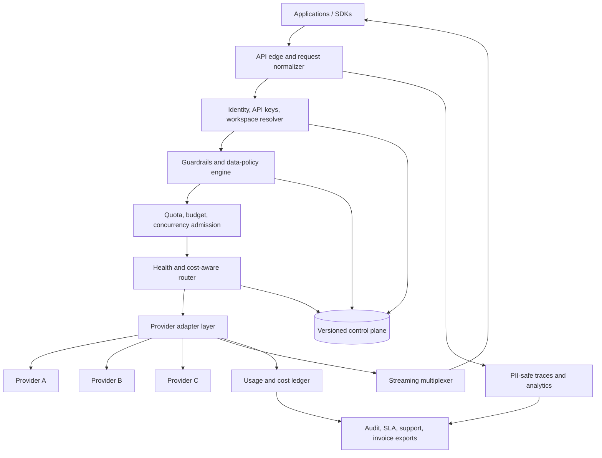

# Capstone 3 — Enterprise Multi-Model AI Gateway

> An OpenRouter-inspired final capstone: design and build the control plane,
> request plane, routing policy, reliability layer, enterprise tenancy, and
> economics behind a unified multi-model AI gateway.

Use this as an alternative final capstone for **Weeks 103–108**. It is not a
fourth month and it does not require access to OpenRouter's private systems.
Build a local simulator with mock providers, then defend the architecture as if
it serves regulated enterprise workloads.

The public product surface that motivates this capstone includes a unified API,
multi-model/provider access, automatic routing and fallbacks, usage analytics,
workspace budgets, management keys, guardrails, data-policy controls, SSO/SAML,
contractual SLAs, invoicing options, dedicated limits, and support tiers. See
the source links at the end for the current public documentation.

## The capstone question

> Design an enterprise AI gateway that lets one application call hundreds of
> models through one API while enforcing tenant policy, selecting a compliant
> provider, surviving provider failures, accounting for every token, and
> producing an auditable operating picture.

The system must make the following promise:

```text
one API
  -> many models and providers
  -> policy-compliant routing
  -> reliable streaming and failover
  -> tenant isolation and fair admission
  -> exact usage and cost evidence
  -> enterprise controls and operational trust
```

This is the production-platform capstone: it takes `vector.dot()`, retrieval,
queues, traces, cost attribution, inference scheduling, and leader election and
turns them into a product someone could actually buy.

## How to use this capstone

1. Design the system in a 60–90 minute staff interview.
2. Build a runnable local gateway with three or more mock providers.
3. Inject latency, rate limits, malformed responses, outages, policy mismatch,
   stream interruption, budget exhaustion, and duplicate requests.
4. Benchmark the gateway and publish the decisions, not only the happy path.
5. Use the rubric before the Week 107 mock interview.

The goal is not to implement SAML, a payment processor, or an inference engine.
The goal is to model their boundaries, contracts, failure modes, and evidence.

## Revision map

| Capability | Review | Why it matters |
|---|---:|---|
| Model-version traffic router | Week 94 | Route by model, provider, policy, and rollout state |
| PII-safe logging and tracing | Week 95 | Prompts and secrets must not enter durable logs |
| Async fan-out and streaming | Week 96 | A provider can fail before or after tokens are committed |
| Token budgets and priority | Week 97 | Enterprise fairness is admission control, not a dashboard |
| Idempotency and tool-call scheduling | Week 98 | Retries must not duplicate effects or billing |
| Per-tenant concurrency and leader election | Week 99 | Distributed admission needs ownership and fencing |
| Work queues and configuration | Week 100 | Providers, policies, and health state change continuously |
| Model registry and health monitor | Week 101 | The router needs versioned capabilities and live signals |
| Cost attribution and safety | Week 102 | Usage, policy, and trust become product features |
| System Design track | Weeks 46–57 | APIs, sharding, caching, CAP, case studies, OOD |
| Algorithmic Forge | Weeks 43–108 | Hashing, heaps, graphs, flow, DP, and boss fights |
| Leetcode Darbar | Parallel | Timed routing, state-machine, heap, and graph fluency |

# Part 1 — Product and system design

## Scenario

You are building a gateway for an enterprise with thousands of workspaces and
multiple AI applications. The gateway fronts providers offering chat,
embeddings, tool calling, structured output, and multimodal inference.

The enterprise wants:

- one OpenAI-compatible API surface;
- a model and provider catalog with capabilities, regions, prices, and health;
- automatic routing and fallback without violating workspace policy;
- separate budgets, keys, members, and limits per workspace;
- exact token, latency, provider, and cost accounting;
- audit-ready data handling and an explicit no-compliant-route failure;
- an operational trail that can be exported to observability systems;
- a commercial layer for invoicing, support, SLAs, dedicated limits, and volume
  commitments.

## Functional requirements

### 1. Unified request API

Support a normalized endpoint such as:

```http
POST /v1/chat/completions
Idempotency-Key: req_123
Authorization: Bearer wk_live_...
```

The request contract must preserve model, messages, tools, response format,
streaming, user, metadata, and policy constraints while hiding provider-specific
wire formats behind adapters.

### 2. Registry and capability discovery

Maintain versioned records for:

- logical models and model versions;
- provider endpoints and regions;
- supported capabilities: tools, JSON/schema output, vision, embeddings,
  reasoning, streaming;
- pricing for prompt, completion, cached, reasoning, image, and request units;
- data policy: training, collection, retention, ZDR eligibility, jurisdiction;
- live health, latency, throughput, quota, and error signals.

Provider metadata is untrusted input. Validate it, version it, and expire stale
health and price data.

### 3. Policy-aware routing

For each request:

1. authenticate the workspace key;
2. resolve workspace, project, user, and tenant policy;
3. filter endpoints by model capability, region, data policy, allowlist, budget,
   and current health;
4. rank the compliant candidates by the configured objective;
5. reserve admission and a retry budget;
6. call the provider through an adapter;
7. normalize usage, timing, errors, and finish reasons;
8. publish a PII-safe trace and exact usage event.

If no endpoint satisfies policy, fail closed with an actionable error. Do not
silently route regulated data to a cheaper non-compliant provider.

### 4. Reliability and fallback

Handle provider timeout, overload, rate limit, malformed response, connection
failure, and model deprecation. Use health-aware circuit breakers and bounded
fallback chains.

The stream boundary is critical:

- before the first token is committed, a request may retry or fail over within
  its retry budget;
- after tokens are committed, transparent replay can duplicate output and side
  effects, so return an in-band stream error and record the partial attempt;
- every attempt has its own provider request ID, usage record, and outcome;
- the logical request has one idempotency key and one final accounting record.

### 5. Enterprise tenancy and administration

Model organization, workspace, project, member, service account, API key,
guardrail, policy, budget, and audit log boundaries. Provide interfaces for:

- SSO/SAML or OIDC identity federation;
- role-based admin controls;
- programmatic key creation, rotation, revocation, and ownership;
- model/provider allowlists and workspace presets;
- daily, weekly, monthly, and lifetime budget controls;
- dedicated rate limits and priority classes;
- contractual SLA and support-tier metadata.

The capstone may mock the identity provider and invoicing system, but the
authorization and audit contracts must be real and testable.

### 6. Data-policy routing

Policies are explicit request inputs and workspace defaults. At minimum support:

```json
{
  "region": "EU",
  "zdr": true,
  "data_collection": "deny",
  "allow_training": false,
  "allowed_providers": ["provider_a", "provider_b"]
}
```

The policy engine must distinguish:

- where data is processed;
- whether a provider may retain it;
- whether a provider may train on it;
- which providers are allowed by the customer;
- what to do when the compliant set is empty.

### 7. Usage, billing, and economics

Record usage from normalized provider responses. Attribute cost to the
organization, workspace, project, user, model, provider, request, and attempt.
Support:

- prompt, completion, reasoning, cached, image, and request units;
- retries and fallbacks without double-counting;
- budgets and reservations before dispatch;
- usage exports and invoice-period aggregation;
- BYOK or dedicated-capacity fee metadata;
- platform fee and discount calculations as versioned pricing rules.

The ledger must be append-only and idempotent. A dashboard number without a
reconcilable event trail is not billing evidence.

### 8. Observability and support

Emit PII-safe metrics, logs, and traces for:

- route decision and rejected candidates;
- provider attempt, TTFT, total latency, throughput, status, and error;
- fallback count and stream boundary;
- token usage, cost, budget, and quota state;
- tenant, workspace, model, provider, region, and policy dimensions;
- SLA burn rate, incidents, and support context.

Support trace broadcasting or export adapters without making an external
observability vendor part of the correctness boundary.

## Non-functional requirements

| Dimension | Target for the local capstone |
|---|---|
| Gateway overhead | < 25 ms p95 excluding provider latency |
| Routing correctness | 100% of policy tests fail closed when no route qualifies |
| Admission | No tenant exceeds configured in-flight limit in stress tests |
| Accounting | Every accepted attempt reconciles exactly once |
| Stream semantics | No transparent retry after first committed token |
| Isolation | Cross-workspace data and budget reads are impossible in tests |
| Control-plane freshness | Config has version, effective time, and rollback path |
| Recovery | Provider outage drains to compliant fallback or explicit error |
| Observability | Every request has a correlation ID and PII-safe outcome event |

Scale the design discussion to thousands of workspaces, hundreds of models,
dozens of providers, high streaming concurrency, and multi-region operation.
The local simulator may be smaller; state the extrapolation.

## Architecture overview



### Control plane versus request plane

The request plane must remain available when non-critical control-plane
components are degraded. Use versioned snapshots for routing policy, registry,
prices, and guardrails. A request records the snapshot version used for its
decision so an incident can be reconstructed.

The control plane owns organization/workspace configuration, provider registry,
pricing, policy, keys, health aggregation, and audit history. The request plane
owns authentication, policy evaluation, admission, route selection, provider
calls, streaming, and usage events.

### Provider adapter contract

```python
class ProviderAdapter(Protocol):
    def capabilities(self) -> ProviderCapabilities: ...
    def invoke(self, request: NormalizedRequest) -> ProviderStream: ...
    def normalize_usage(self, response: ProviderResponse) -> Usage: ...
    def classify_error(self, error: Exception) -> ProviderError: ...
```

Adapters isolate provider-specific authentication, payloads, tool-call shape,
usage fields, error codes, and streaming events. The router never contains
provider-specific branching.

## Routing decision contract

The route decision must be explainable and reproducible:

```json
{
  "request_id": "req_123",
  "policy_snapshot": "policy_v17",
  "candidates_considered": ["provider_a:model_x", "provider_b:model_x"],
  "candidates_rejected": [
    {"endpoint": "provider_c:model_x", "reason": "region_mismatch"}
  ],
  "selected": "provider_a:model_x",
  "objective": "balanced_cost_latency",
  "score_breakdown": {
    "estimated_cost": 0.32,
    "latency": 0.18,
    "error_rate": 0.04,
    "quality_signal": 0.81
  },
  "fallbacks": ["provider_b:model_x"],
  "registry_version": "registry_104"
}
```

A basic score can be:

```text
score = w_latency * normalized_latency
      + w_cost * normalized_cost
      + w_error * recent_error_rate
      - w_quality * quality_signal
      + w_queue * estimated_queue_delay
```

Weights are policy-controlled and versioned. Do not optimize average latency
while violating p95, tenant fairness, capability, or data-policy constraints.

## Admission, fairness, and leader election

Admission is made before dispatch:

1. validate the workspace and policy snapshot;
2. reserve request/concurrency and estimated token budget;
3. acquire a fencing token for the tenant shard or use a strongly consistent
   lease service;
4. dispatch only if the reservation is valid;
5. settle actual usage and release unused reservation;
6. expire or reconcile abandoned reservations.

The design must explain how two gateway replicas cannot both admit beyond a
tenant's limit during a leader transition. A local semaphore is not a
distributed concurrency limiter.

## Durable data model

Minimum entities:

```text
Organization(org_id, plan, sla_tier, billing_account, policy_version)
Workspace(workspace_id, org_id, budget, limits, region, guardrail_version)
ApiKey(key_id, workspace_id, hash, scopes, created_at, expires_at, revoked_at)
Model(model_id, version, capabilities, logical_price, status)
Endpoint(endpoint_id, provider, model_version, region, policies, health_version)
RouteDecision(request_id, snapshot_versions, candidates, selected, reasons)
Attempt(attempt_id, request_id, endpoint_id, start, first_token, end, outcome)
UsageEvent(attempt_id, tokens, units, provider_cost, platform_fee, event_version)
BudgetReservation(reservation_id, workspace_id, estimate, state, fencing_token)
InvoiceLine(invoice_id, workspace_id, period, usage, fees, discounts)
AuditEvent(actor, workspace_id, action, target, policy_version, timestamp)
```

Use append-only usage events and deterministic settlement keys. Materialized
workspace dashboards can be eventually consistent; the ledger and budget
settlement contract cannot silently lose or duplicate accepted attempts.

# Part 2 — Required implementation

Build a local gateway simulator with at least three mock provider endpoints:

- one cheap/slow endpoint;
- one expensive/fast endpoint;
- one unreliable or policy-incompatible endpoint.

Implement these minimum components:

1. normalized request/response and provider adapters;
2. capability and policy filtering;
3. explainable route selection with a versioned snapshot;
4. bounded pre-stream fallback and explicit post-stream failure;
5. per-workspace budget and per-tenant concurrency admission;
6. idempotent usage/cost ledger;
7. PII-safe trace event and route-decision export.

Implement at least **three** of the seven components from scratch; the rest may
use small standard-library helpers. Include tests for every failure mode in the
matrix below.

## Failure-injection matrix

| Failure | Expected behavior |
|---|---|
| Provider timeout before tokens | Retry/fail over within bounded retry budget |
| Provider disconnect after first token | Do not transparently replay; emit stream error and partial-attempt event |
| No provider meets ZDR/region policy | Fail closed; explain rejected candidates |
| Duplicate idempotency key | Return/reconcile the original logical request according to contract |
| Workspace budget exhausted | Reject before provider dispatch |
| Tenant concurrency saturated | Queue, reject, or shed according to priority policy |
| Leader lease expires mid-admission | Fencing prevents stale owner from committing admission |
| Provider price changes | New version applies to new decisions; old ledger remains reproducible |
| Malformed provider usage | Quarantine settlement and alert; never invent silent cost |
| PII appears in payload | Redact or reject before durable trace emission |

# Part 3 — Evidence and portfolio release

Submit a public-quality release containing:

## Product definition

- user and buyer personas;
- Standard versus Enterprise capability boundary;
- non-goals and build-versus-buy decisions;
- explicit statement that the design is OpenRouter-inspired, not a claim about
  private implementation details.

## Architecture and implementation

- requirements and SLO document;
- architecture diagram and control-plane/request-plane boundary;
- runnable gateway simulator;
- provider adapter contract and three mock providers;
- route decision examples, rejected-policy examples, and failure traces;
- tenancy, admission, leader-election, idempotency, and ledger tests.

## Benchmark and operations

- throughput and p50/p95 gateway overhead;
- provider outage and fallback benchmark;
- policy-filter correctness matrix;
- fairness/concurrency stress result;
- cost reconciliation report;
- PII/logging threat model;
- dashboard or export showing route, latency, tokens, failures, and cost;
- incident runbook for provider outage, policy mismatch, budget drift, and
  ledger reconciliation.

## Staff defense

Record a 15-minute explanation answering:

1. Why is the gateway valuable if providers already expose APIs?
2. What must be strongly consistent, and what can be eventually consistent?
3. How do you prove a fallback did not violate data policy?
4. When is retrying a stream unsafe?
5. How do you prevent one tenant from buying all provider capacity?
6. How do you reconcile provider usage with customer invoices?
7. Which features should be bought from an identity, billing, or observability
   vendor rather than built?

# Self-grading rubric — 24 points

Score each dimension 0–2. A passing capstone requires **18/24**, no zero in
policy, reliability, tenancy, or accounting, and a complete evidence bundle.

| Dimension | 0 | 1 | 2 |
|---|---|---|---|
| Product boundary | API proxy only | Lists enterprise features | Defines buyer, guarantees, non-goals, and build/buy boundary |
| API normalization | Provider-specific | Basic adapter | Stable contract with capability/error/usage normalization |
| Registry | Static model list | Registry exists | Versioned models/endpoints/capabilities/prices/health |
| Routing | Round robin | Cost/latency choice | Explainable, policy-filtered, versioned, workload-aware decision |
| Data policy | Mentioned | Region or ZDR check | Fail-closed multi-dimensional policy with audit evidence |
| Reliability | Retry everything | Basic fallback | Stream-aware retry boundary, circuit breakers, bounded budgets |
| Tenancy | API key only | Workspace limits | Isolation, fairness, admission, fencing, and admin roles |
| Accounting | Approximate dashboard | Token totals | Idempotent attempt ledger, reservations, settlement, invoices |
| Observability | Logs only | Metrics/traces | PII-safe route/attempt/cost/SLA evidence and exports |
| Security | Secret in config | Key rotation | Threat model, scopes, audit, redaction, and least privilege |
| Benchmark | Happy-path timing | One load test | Failure, fairness, policy, and reconciliation benchmarks |
| Staff defense | Describes components | Answers trade-offs | Makes precise guarantees and defends what not to build |

## Boss extensions

Choose one if the core capstone passes:

- multi-region active-active routing with jurisdiction fail-closed behavior;
- contextual bandit routing with exploration budget and rollback;
- dedicated-capacity scheduler with reserved throughput and discounted fee;
- BYOK key isolation and provider credential rotation;
- tool-call-aware routing and structured-output compatibility matrix;
- invoice reconciliation against delayed or contradictory provider usage;
- OpenTelemetry/Langfuse/Datadog-style trace broadcasting with tenant filters;
- semantic cache with policy-aware cache keys and cross-tenant isolation.

## Compact interview doc

```text
Start: unify the API, then define the enterprise guarantee.
1. Requirements: models, providers, tenants, policy, scale, SLOs, billing.
2. Request path: auth -> policy -> admission -> route -> adapter -> stream.
3. Control plane: registry, pricing, health, workspace policy, keys, audit.
4. Reliability: pre-token failover; post-token error; circuit breakers.
5. Tenancy: budgets, concurrency, priority, fencing, no cross-workspace reads.
6. Economics: append-only usage events, exact settlement, invoice exports.
7. Observability: route decisions, provider attempts, TTFT, tokens, cost, SLA.
8. Trade-offs: strong consistency only for admission/ledger/policy snapshots;
   eventual consistency for dashboards and aggregate analytics.
Close: explain one rejected design and one capability you would buy.
```

## Public source anchors

- [OpenRouter pricing and enterprise feature matrix](https://openrouter.ai/pricing)
- [Enterprise quickstart](https://openrouter.ai/docs/cookbook/get-started/enterprise-quickstart)
- [Provider routing, performance, and geographic metadata](https://openrouter.ai/providers/apply)
- [API error and streaming failover semantics](https://openrouter.ai/docs/api/reference/errors-and-debugging)
- [Zero Data Retention routing](https://openrouter.ai/docs/guides/features/zdr)
- [Provider logging and data-policy controls](https://openrouter.ai/docs/guides/privacy/provider-logging)
- [Organization guardrails](https://openrouter.ai/docs/guides/features/guardrails/overview)
