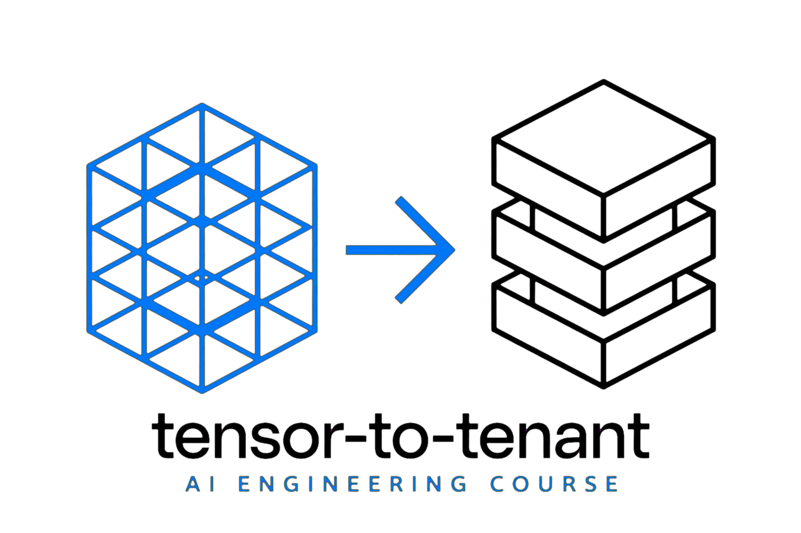
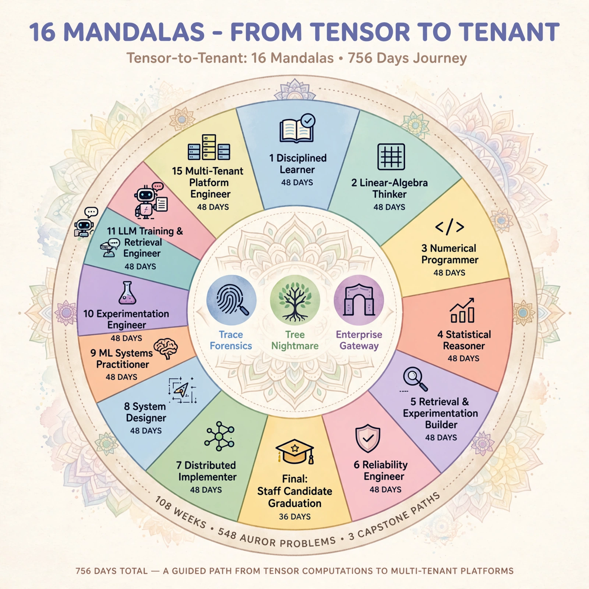
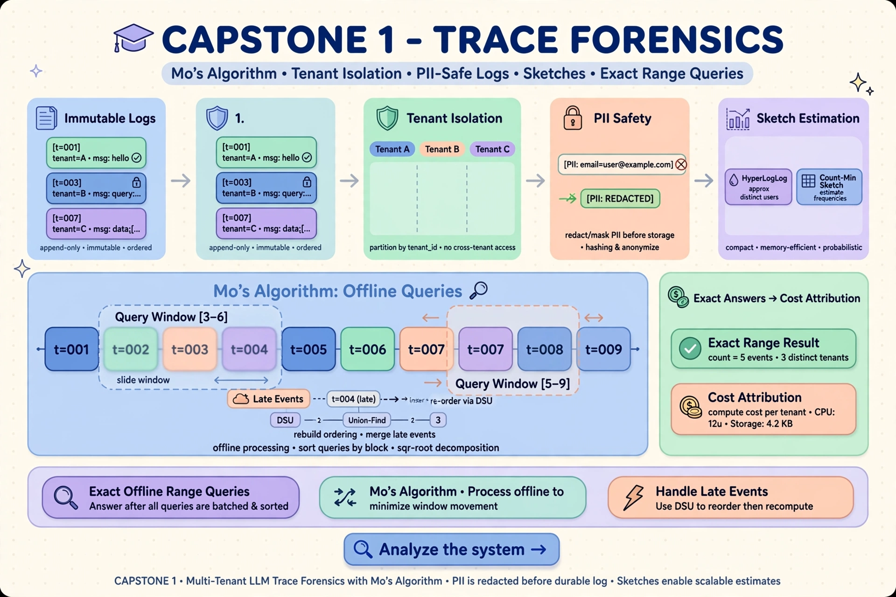
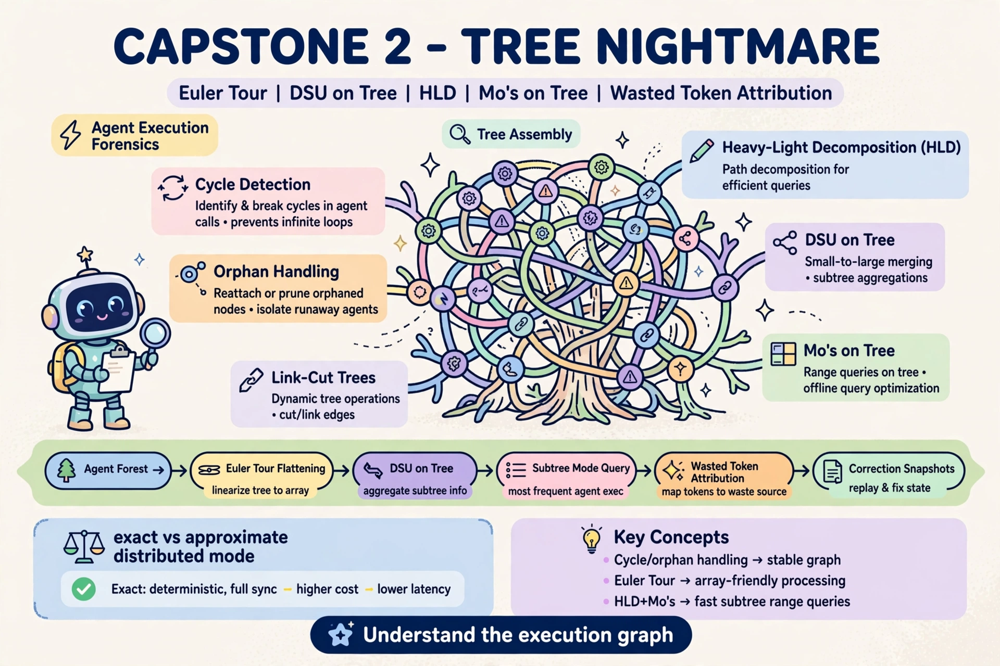
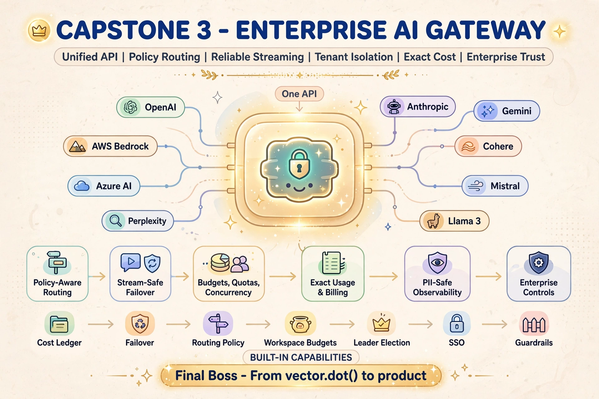

# `tensor-to-tenant`



A consolidated, production-oriented learning path that turns you into an AI / software engineer who can build, evaluate, deploy, and operate ML and LLM systems and pass the interviews that get you hired to do it.

### The arc: tensor → tenant

```text
tensor     — vector spaces, SVD, kernels, attention (Weeks 7–30)
    ↓
model      — transformers, RAG, agents, fine-tuning (Weeks 70–81)
    ↓
inference  — vLLM, SGLang, FlashAttention, quantization (Weeks 82–93)
    ↓
platform   — router, quotas, tracing, model registry, cost (Weeks 94–102)
    ↓
tenant     — multi-tenant isolation, admission, fairness (CAPSTONE)
```

---

## Table of Contents

1. [Course Goal](#course-goal)
2. [Why this course](#why-this-course)
3. [Course Structure (10 Phases)](#course-structure-10-phases)
4. [The Apprenticeship Model](#the-apprenticeship-model)
5. [Algorithmic Forge](#algorithmic-forge)
6. [System Design Track](#system-design-track)
7. [Leetcode Darbar](#leetcode-darbar)
8. [Sailboat Retrospective](#sailboat-retrospective)
9. [Full 108-Week Curriculum](#full-108-week-curriculum)
10. [Phase Details](#phase-details)
   - [Phase 1 — Orientation, Tooling, Diagnostics (Weeks 1–6)](#phase-1--orientation-tooling-and-diagnostics--weeks-16)
   - [Phase 2 — Mathematical Foundations I (Weeks 7–18)](#phase-2--mathematical-foundations-i--weeks-718)
   - [Phase 3 — Mathematical Foundations II (Weeks 19–30)](#phase-3--mathematical-foundations-ii--weeks-1930)
   - [Phase 4 — Engineering Micro-Projects (Weeks 31–45)](#phase-4--engineering-micro-projects-and-applied-ml-primitives--weeks-3145)
   - [Phase 5 — System Design & Distributed Systems (Weeks 46–57)](#phase-5--system-design-and-distributed-systems-fundamentals--weeks-4657)
   - [Phase 6 — ML Lifecycle, Experimentation & MLOps (Weeks 58–69)](#phase-6--ml-lifecycle-experimentation-and-mlops--weeks-5869)
   - [Phase 7 — LLM Training, RAG, Agents, Evaluation (Weeks 70–81)](#phase-7--llm-training-rag-agents-and-evaluation--weeks-7081)
   - [Phase 8 — LLM Inference & Performance Engineering (Weeks 82–93)](#phase-8--llm-inference-and-performance-engineering--weeks-8293)
   - [Phase 9 — Production AI Platform Engineering (Weeks 94–102)](#phase-9--production-ai-platform-engineering--weeks-94102)
   - [Phase 10 — Capstone, Portfolio & Interview Readiness (Weeks 103–108)](#phase-10--capstone-portfolio-and-interview-readiness--weeks-103108)
11. [Milestone Gates](#milestone-gates)
12. [Source Material Mapping](#source-material-mapping)
   - [Math Curriculum Path](#math-curriculum-path)
   - [Engineering Implementation Tasks](#engineering-implementation-tasks)
   - [Engineering Practice Exercises](#engineering-practice-exercises)
   - [System Design Roadmap](#system-design-roadmap)
   - [ML Systems & MLOps Reading](#ml-systems--mlops-reading)
   - [LLM Inference Papers & Systems](#llm-inference-papers--systems)
   - [LLM Training, RAG, Agents & Evaluation](#llm-training-rag-agents--evaluation)
13. [Weekly Template & Repo Structure](#weekly-template--repo-structure)
14. [Interview Preparation Integration](#interview-preparation-integration)
15. [Behavioral Interview Track (CARL Stories)](#behavioral-interview-track-carl-stories)
16. [Final Capstone Requirements](#final-capstone-requirements)
17. [Completion Criteria](#completion-criteria)
18. [Final Capstone Artifact](#final-capstone-artifact)
19. [Reference Resources](#reference-resources)
    - [YouTube Playlists](#youtube-playlists)
    - [Books & Reading List](#books--reading-list)
    - [Research Papers](#research-papers)
    - [Blog & Article URLs](#blog--article-urls)
    - [Interview Preparation Roadmap](#interview-preparation-roadmap)
14. [Repository Layout](#repository-layout)

---

## Course Goal

Train into a production-oriented AI/software engineer who can:

1. Build and evaluate ML/LLM systems.
2. Understand LLM inference, RAG, agents, and serving infrastructure.
3. Implement production-grade backend and distributed-system patterns.
4. Pass system design, coding, ML, and behavioral interviews.
5. Produce a portfolio of reproducible projects, benchmarks, and design docs.

## Why this course

The market has plenty of specialists. It has far fewer engineers who can move
vertically from numerical reasoning to production AI platform judgment.

This apprenticeship is designed to produce a **production-minded Staff AI
Systems Engineer with algorithmic depth**—someone who can connect the math, the
algorithms, the ML lifecycle, the model stack, and the operational platform.

### The scarcity is in the seams

Many engineers are strong in one lane but have never crossed the boundary into
the next one:

- Can solve Leetcode problems, but would send raw emails into Kafka before durable logging.
- Can build a RAG demo, but treats HNSW as magic and cannot explain Recall@K by query slice.
- Can discuss PagedAttention, but has never built a per-tenant concurrency limiter with leader election.
- Knows transformers, but cannot diagnose why a logistic-regression baseline is miscalibrated.

Tensor-to-Tenant makes those seams the curriculum. The point is not to collect
topic badges; it is to repeatedly carry an idea from first principles into a
system with workload constraints, failure modes, evidence, and trade-offs.

### The vertical capability ladder

| Layer | Graduate capability |
|---|---|
| **Math** | Recognize when an SVD is unstable, inspect the condition number, and choose a numerically defensible approach. |
| **Algorithms** | Move quickly through the 548 Darbar patterns, then go deep on flows, suffix structures, Euler tours, and DSU on Tree when the workload requires it. |
| **ML** | Frame the problem, catch leakage, run bootstrap confidence intervals, and evaluate slices rather than celebrating one aggregate metric. |
| **LLM systems** | Build and critique SFT, LoRA, DPO, GRPO, RAG, agents, memory, evaluation, and guardrails—with an understanding of where each breaks. |
| **Inference** | Read a roofline plot, identify memory-bound behavior, explain PagedAttention, judge when speculative decoding helps, and model serving economics. |
| **Platform** | Ship routing, quotas, tracing, idempotency, work queues, registries, tenant isolation, and cost attribution—the Week 102 platform is working evidence, not slides. |
| **Staff judgment** | Write design docs, challenge assumptions, choose exact versus approximate guarantees from workload shape, and defend trade-offs in review. |

The intended outcome is a straight line from `vector.dot()` to a per-tenant
concurrency limiter with leader election. Mathematics informs the algorithm;
the algorithm informs the primitive; the primitive informs the distributed
design; the design becomes a reliable AI platform.

### What this prepares someone to do

Strong graduates can target roles such as:

- Staff AI Engineer
- Staff ML Systems Engineer
- AI Infrastructure or LLM Platform Engineer
- Retrieval/Search Engineer
- Inference Performance Engineer
- Production ML Platform Engineer

The differentiator is not that the graduate has “seen” all these subjects. It
is that the portfolio shows they can **explain, implement, benchmark, operate,
and defend** the resulting systems.

What this course can provide is Staff-level technical breadth, reasoning, and
portfolio evidence. When the graduate enters that environment, they spend less
time discovering basic production failure modes and more time exercising
judgment, influence, and ownership.

---

## Course Structure (10 Phases)

| Phase | Weeks | Theme |
|---:|---:|---|
| 1 | 1–6 | Orientation, tooling, and diagnostics |
| 2 | 7–18 | Mathematical foundations I: linear algebra & numerical methods |
| 3 | 19–30 | Mathematical foundations II: calculus, autodiff, probability, statistics |
| 4 | 31–45 | Engineering micro-projects and applied ML primitives |
| 5 | 46–57 | System design and distributed systems fundamentals |
| 6 | 58–69 | ML lifecycle, experimentation, and MLOps |
| 7 | 70–81 | LLM training, RAG, agents, and evaluation |
| 8 | 82–93 | LLM inference and performance engineering |
| 9 | 94–102 | Production AI platform engineering |
| 10 | 103–108 | Capstone, portfolio, and interview readiness |

---

### The weekly contract: core first, depth second

Every week has two lanes:

- **Core deliverable:** the one artifact that keeps the learner moving. It is
  sized for the stated weekly effort and is the requirement for progress.
- **Optional depth work:** a harder extension such as a proof, from-scratch
  implementation, benchmark, failure analysis, or production trade-off note.
  It preserves the course's advanced ceiling without making every week a
  prerequisite-heavy research project.

Every core artifact records evidence in four forms: code or implementation,
benchmark or result, design document or technical explanation, and a short
retrospective. The curriculum tracks evidence shipped, not attendance.

### Blocking gates, remediation, and recovery

Milestone gates are real dependencies. If a gate is not passed, the next gate
is blocked until the learner completes a focused remediation cycle and submits
the missing evidence. Remediation is specific to the failed criterion; it does
not require restarting the entire course.

Recovery weeks are planned buffer windows after Weeks 6, 14, 22, 30, 38, 46,
54, 62, 70, 78, 86, 94, and 102. They are not extra curriculum topics: use
them to close an evidence gap, recover from a missed week, rerun a benchmark,
or take a deliberate rest before continuing.

### Portfolio releases

### Week 5 paper anchor: hypothesis choice and generalization

Before the curriculum introduces formal model training, Week 5 uses Michael
Timothy Bennett's [*The Optimal Choice of Hypothesis Is the Weakest, Not the
Shortest*](https://arxiv.org/abs/2301.12987v4) as a critical reading on
induction, generalization, and inductive bias.

The paper argues—under its finite-language and uniformly distributed task
assumptions—that maximizing a hypothesis's **weakness** (the size of the set of
possibilities it leaves open) can generalize better than minimizing description
length. Learners should treat this as a claim to examine, not a replacement for
MDL, regularization, or task-specific priors.

The bounded Week 5 paper lab is:

- define the paper's terms: task, model, extension, weakness, and description length;
- reproduce or critique the binary-arithmetic toy comparison on a small finite dataset;
- report generalization rate, extent of generalization, and the assumptions that make the comparison meaningful; and
- connect the result to later leakage checks, calibration, slice-based retrieval evaluation, and LLM behavior under distribution shift.

The evidence is one technical explanation plus a small reproducible experiment
or a falsifiable critique. It does not add another phase or change the 100-math-
module count; it gives the early diagnostic a stronger theory-of-generalization
anchor.
- **Week 30 — Foundations release:** math diagnostic, numerical linear algebra
  lab, statistics/experimentation toolkit, and an explanation of the work.
- **Week 69 — Engineering + Systems release:** primitive library, system design
  portfolio, experimentation toolkit, monitoring plan, and a postmortem.
- **Week 108 — LLM Platform release:** inference benchmark, production platform
  layer, capstone, mock-interview scorecard, and 30-day job plan.

The cookiecutter generates the release checklists, evidence folders, recovery
plans, remediation templates, and badge verifier alongside the weekly journals.
In a generated repo, `make badge=30`, `make badge=69`, or `make badge=108`
checks core evidence plus the corresponding blocking gate before marking a
program badge as earned.

### The mandala progression

The 108-week apprenticeship is also a sequence of **15 complete 48-day
capability cycles plus a final 36-day graduation cycle**. Each mandala produces
a new professional identity, evidence for it, a retrospective, and a stronger
operating system for the next cycle. The full transformation map is in
[`MANDALA.md`](./MANDALA.md).

<a href="./MANDALA.md">
  
</a>

---

## Algorithmic Forge

The programming-camp material is a **parallel algorithmic spine**, not an
eleventh phase. Every Friday gets a bounded Forge drill connected to the
current AI-systems work. The canonical taxonomy and 108-week map live in
[`ALGORITHMIC_FORGE.md`](./ALGORITHMIC_FORGE.md).

| Level | Role in the 108-week course | Default timebox |
|---|---|---:|
| **Core** | Must implement and explain; directly supports the current phase | 45–90 min |
| **Supporting** | Guided lab or one representative problem; promote when relevant | 45–120 min |
| **Archive** | Reference only; no scheduled obligation | 0 min scheduled |
| **Boss fight** | Selected advanced topic integrated with a gate or capstone | 2–3 hr |

The Core spine includes graphs and topological sort, shortest paths, dynamic
programming, greedy methods, tries and pattern matching, heaps, Fenwick and
segment trees, DSU, Euler tours, binary search, randomized algorithms, number
theory basics, probability, combinatorics, and the selected flow/matching
concepts needed for systems work.

Computational geometry, suffix trees/automata, HLD, dynamic trees, advanced
group theory, Burnside/Polya, Dancing Links, and exotic contest machinery stay
Supporting, Archive, or Boss-fight material. Capstone 1 (Mo’s over immutable
traces) remains required; Capstone 2 (Euler Tour + DSU on Tree) becomes the
optional Week 108 tree-forensics boss fight rather than a fourth month.

## System Design Track

System design is the canonical architecture track for **Weeks 46–57**, not an
additional phase. It replaces the old short list of generic interview prompts
with a layered progression through foundations, distributed-systems patterns,
technology labs, case-study families, and OOD/LLD. The full map is in
[`SYSTEM_DESIGN_TRACK.md`](./SYSTEM_DESIGN_TRACK.md).

The weekly design loop is:

```text
requirements → API/data model → scale/partition/cache/queue
             → failure/consistency/observability → AI extension
```

The track deliberately connects cases such as Bitly, Redis-backed rate
limiting, Dropbox, WhatsApp, search, schedulers, payments, Kafka/Flink
pipelines, ChatGPT, and Figma multiplayer to the later platform work. Gate 5
requires a defensible design from any case family, including capacity math,
tenant isolation, idempotency, failure semantics, cost, and one AI extension.

## Leetcode Darbar

[`LEETCODE_DARBAR.md`](./LEETCODE_DARBAR.md) is the parallel high-achiever lane.
Its target catalog is 548 problems (255 Easy, 240 Medium, 53 Hard), tracked as
interview execution rather than core attendance. The Standard Apprenticeship
does a small phase-aligned problem set most weeks; the optional **Auror Track**
targets all 548, averaging about five per week.

Darbar is intentionally complementary:

| Lane | Learner behavior | Result |
|---|---|---|
| Leetcode Darbar | Fast pattern recognition and timed implementation | Interview fluency |
| Algorithmic Forge | Derivation, adversarial analysis, advanced structures | Algorithmic depth |
| Core curriculum | Workload-shaped systems implementation | Production judgment |

Darbar never overrides a core deliverable or blocking gate. A solved problem
needs an explanation, final complexity, and a link to the production concept it
reinforces. Generated repos expose `make darbar=42`, `make progress`, and the
optional `make auror` verifier.

## Sailboat Retrospective

Every week ends with a short [Sailboat Retro](./SAILBOAT_RETRO.md). It is the
human navigation layer of the apprenticeship:

| Sailboat element | Weekly question |
|---|---|
| **Island / destination** | What capability am I trying to reach? |
| **Wind** | What helped progress? |
| **Anchor** | What slowed me down? |
| **Rocks** | What could derail next week? |
| **Boat position** | Am I ahead, on track, or drifting? |
| **Next heading** | What is the single most important adjustment? |

The retro is part of the existing weekly evidence and review ritual, not a new
assignment or gate. It gives the learner permission to recover, change pace,
protect the core deliverable, and keep the long apprenticeship pointed toward
the next capability rather than merely the next checkbox.

---

## Full 108-Week Curriculum

The table below lists the **core deliverable** for every instructional week.
The generated learner repo adds an optional depth lane and an evidence record
to every journal entry.

| Week | Module | Focus | Mode | Core deliverable |
|---:|---|---|---|---|
| 1 | Orientation and course OS | Course setup, tracker, repo, weekly template | implement | Course dashboard + README |
| 2 | Python engineering refresh | Typing, testing, async basics | implement | CLI project skeleton with tests |
| 3 | Numerical Python | NumPy, vectorization, broadcasting | implement | Vector math utility library |
| 4 | Reproducibility | Git, notebooks, experiment tracking | implement | Reproducible notebook + Makefile |
| 5 | Math diagnostic and induction | Linear algebra, probability, hypothesis choice, and generalization | implement | Diagnostic report + gap map + paper lab |
| 6 | Systems diagnostic | HTTP, Docker, APIs, Linux basics | implement | Containerized hello-service |
| 7 | Linear algebra I | Vector spaces, span, basis, dimension | implement | Problem set + concept map |
| 8 | Linear algebra II | Linear independence, rank, nullity | implement | Solver exercises + notes |
| 9 | Linear algebra III | Inner products, norms, dual norms | implement | Norm/distance library |
| 10 | Linear algebra IV | Orthogonality, projections, Gram-Schmidt | implement | Projection demo |
| 11 | Linear algebra V | Linear transformations, change of basis | implement | Coordinate transform lab |
| 12 | Linear algebra VI | Eigenvalues, eigenvectors, diagonalization | implement | PCA-style mini lab |
| 13 | Linear algebra VII | PSD matrices, quadratic forms, Rayleigh quotient | implement | Proof + visualization |
| 14 | Linear algebra VIII | SVD, pseudoinverse, low-rank approximation | implement | Low-rank compression demo |
| 15 | Numerical linear algebra I | Matrix norms, condition numbers, perturbation | implement | Perturbation experiment |
| 16 | Numerical linear algebra II | LU, QR, Cholesky decomposition | implement | Decomposition library |
| 17 | Numerical linear algebra III | Iterative solvers, power iteration, Krylov methods | implement | Solver benchmark |
| 18 | Numerical linear algebra IV | Randomized SVD, tensor notation | implement | Randomized approximation lab |
| 19 | Calculus I | Partial derivatives, gradients, directional derivatives | implement | Gradient visualizer |
| 20 | Calculus II | Jacobians, Hessians, Taylor approximations | implement | Curvature lab |
| 21 | Calculus III | Chain rule on computational graphs | implement | Manual backprop worksheet |
| 22 | Automatic differentiation | Forward/reverse mode, JVPs, VJPs | implement | Tiny autodiff prototype |
| 23 | Probability I | Probability spaces, conditioning, Bayes theorem | implement | Probability problem set |
| 24 | Probability II | Random variables, distributions, transformations | implement | Simulation notebook |
| 25 | Probability III | Random vectors, covariance, correlation | implement | Covariance/correlation lab |
| 26 | Probability IV | LLN, CLT, delta method | implement | Monte Carlo convergence demo |
| 27 | Statistics I | MLE, MAP, estimator bias/variance | implement | Estimator comparison |
| 28 | Statistics II | Hypothesis testing, p-values, Type I/II errors | implement | Test implementation |
| 29 | Statistics III | Confidence intervals, bootstrap, permutation tests | implement | Bootstrap CI package |
| 30 | Statistics IV | Power, MDE, sample size, multiple testing | implement | Experiment-size calculator |
| 31 | Retrieval math | Cosine similarity, exact KNN | implement | Vector search mini-lab |
| 32 | Top-K systems | Memory-bounded KNN, streaming Top-K | implement | Heap-based Top-K service |
| 33 | Ranking pipelines | Dynamic Top-K, two-stage retrieval/reranking | implement | Reranking prototype |
| 34 | Rate limiting I | Sliding-window and token bucket rate limiters | implement | API limiter module |
| 35 | Caching | LRU cache and TTL cache | implement | Cache simulator with tests |
| 36 | Text chunking | Token-aware and recursive sentence chunking | implement | Chunking library |
| 37 | PII handling | PII span merging, regex/NER detection | implement | Redaction utility |
| 38 | Calibration | Expected Calibration Error, Brier score | implement | Reliability dashboard |
| 39 | Ranking metrics | NDCG, MRR, Recall@K | implement | Retrieval evaluator |
| 40 | Batching | Thread-safe inference batcher | implement | Concurrent batcher |
| 41 | Resilience | Retry, exponential backoff, jitter, circuit breaker | implement | Fault-tolerance kit |
| 42 | Sketches | Count-Min Sketch, Bloom filter | implement | Probabilistic data structures |
| 43 | Cardinality/routing | HyperLogLog, consistent hashing | implement | Distributed routing lab |
| 44 | Load balancing | Weighted round robin, rendezvous hashing | implement | Load balancer module |
| 45 | IDs/traffic | Snowflake IDs, leaky bucket, sliding-window counter | implement | Platform primitives lab |
| 46 | System design framework | Requirements, constraints, API design | read_diagram | Design doc template |
| 47 | Data and APIs | Data models, observability, contracts | read_diagram | API design exercise |
| 48 | Rate limiting design | Token bucket, sliding windows at scale | read_diagram | Rate limiter design writeup |
| 49 | Scaling reads/writes | Caching, replication, contention | read_diagram | Scaling pattern notes |
| 50 | Large blobs | Storage, CDN, media pipelines | read_diagram | Blob storage design |
| 51 | Workflow systems | Orchestration vs choreography | read_diagram | Workflow state design |
| 52 | Schema evolution | Backward compatibility, contracts | read_diagram | Schema migration plan |
| 53 | Case studies I | URL shortener, Dropbox | read_diagram | Two design docs |
| 54 | Case studies II | Ticketmaster, News Feed | read_diagram | Two design docs |
| 55 | Case studies III | WhatsApp, LeetCode | read_diagram | Two design docs |
| 56 | Case studies IV | Uber, web crawler | read_diagram | Two design docs |
| 57 | Case studies V | Ad click aggregator, payments | read_diagram | Trade-off analysis |
| 58 | ML problem framing | Objectives, constraints, iterative development | read_diagram | ML project charter |
| 59 | Data quality | Labeling, weak supervision, augmentation | read_diagram | Data quality checklist |
| 60 | Leakage/contamination | Detection, eval tracking, versioning | read_diagram | Leakage audit |
| 61 | Offline evaluation | Baselines, slices, confidence intervals | implement | Eval harness |
| 62 | Online evaluation | A/B tests, shadow deployment, canary, bandits | read_diagram | Rollout plan |
| 63 | A/B calculator | Lift, z-score, p-value, confidence intervals | implement | `analyze_ab_test` function |
| 64 | Bootstrap methods | Paired bootstrap for model comparisons | implement | `bootstrap_ci` package |
| 65 | SRM detection | Sample-ratio mismatch, chi-square diagnostics | implement | SRM detector |
| 66 | Feature flags | Rules, rollouts, sticky assignment | implement | Flag engine |
| 67 | Experiment assignment | Deterministic assignment, namespaces | implement | Assignment service |
| 68 | Monitoring | Drift, observability, four-layer monitoring | read_diagram | Monitoring dashboard spec |
| 69 | Production failures | Distribution shift, postmortems | read_diagram | Incident postmortem template |
| 70 | LLM anatomy | Transformer, tokenizer, matmul | read_diagram | Model anatomy notes |
| 71 | LLM data pipelines | Cleaning, deduplication, tokenization | read_diagram | Dataset card |
| 72 | Fine-tuning | SFT, LoRA, QLoRA, DoRA | read_diagram | Fine-tuning plan |
| 73 | Alignment | RLHF, DPO, ORPO, GRPO | read_diagram | Preference eval plan |
| 74 | Distributed training | DDP/FSDP, tensor/pipeline parallelism, ZeRO | read_diagram | Training architecture map |
| 75 | Vector search | HNSW, IVF-PQ, product quantization | deploy_benchmark | Index benchmark |
| 76 | Retrieval patterns | Hybrid search, query rewriting, chunking | implement | Retrieval lab |
| 77 | Retrieval fusion | BM25 + dense + reranker, RRF | implement | Fusion service |
| 78 | Retrieval eval | Query slices, macro metrics, regressions | implement | Slice evaluation report |
| 79 | Prompt systems | Prompt template renderer, version registry | implement | Prompt management tool |
| 80 | Memory/context | Conversation memory, context optimizer | implement | Memory service |
| 81 | Agent foundations | ReAct, plan-execute, tool calling, guardrails | implement | Agent prototype |
| 82 | GPU performance | Compute/memory/overhead regimes, FlashAttention | read_diagram | Performance primer notes |
| 83 | Inference arithmetic | Roofline model, arithmetic intensity | read_diagram | Model intensity worksheet |
| 84 | PagedAttention/vLLM | KV paging, block tables | deploy_benchmark | vLLM deployment |
| 85 | vLLM internals | Scheduler, block manager, code paths | read_diagram | Internal anatomy notes |
| 86 | vLLM metrics | Running/waiting requests, latency histograms | read_diagram | Metrics schema |
| 87 | Observability | Prometheus/Grafana for serving | deploy_benchmark | Live inference dashboard |
| 88 | Benchmarking | Request-rate sweeps, saturation points | read_diagram | Benchmark methodology doc |
| 89 | SGLang | RadixAttention, prefix reuse | deploy_benchmark | SGLang comparison report |
| 90 | Scheduling | Orca, continuous batching, chunked prefill | read_diagram | Scheduler comparison |
| 91 | Quantization | FP8, AWQ, GPTQ, KV cache compression | read_diagram | Quality/throughput table |
| 92 | Speculative/long context | Medusa, EAGLE, StreamingLLM, KV eviction | read_diagram | Latency/memory lab |
| 93 | Disaggregation | DistServe, Splitwise, Mooncake, autoscaling | read_diagram | Disaggregated serving plan |
| 94 | Traffic routing | Model router, kill switch, sticky rollout | implement | Router service |
| 95 | Safe observability | PII redaction, end-to-end request tracing | implement | Trace + safe logs |
| 96 | Fan-out/streaming | Partial failures, token stream multiplexing | implement | Resilient aggregator |
| 97 | Quotas/priority | Token budgets, gateway prioritization | implement | Quota/priority service |
| 98 | Workflow execution | DAG scheduler, idempotency | implement | Workflow engine |
| 99 | Fairness/HA | Per-tenant limits, leader election | implement | Tenant limiter + HA lab |
| 100 | Async infrastructure | Distributed work queue, config service | implement | Queue/config platform |
| 101 | Model lifecycle | Health monitor, registry/promotion | implement | Model ops pipeline |
| 102 | Cost/safety/caching | Semantic/embedding cache, injection detection, cost attribution | implement | Cost/safety platform |
| 103 | Capstone planning | Requirements, architecture, eval plan | read_diagram | Capstone design doc |
| 104 | Capstone build I | Core API, retrieval/agent flow | implement | Working prototype |
| 105 | Capstone build II | Evaluation, observability, guardrails | implement | Monitored prototype |
| 106 | Capstone build III | Load testing, optimization, cost tuning | implement | Performance report |
| 107 | Mock interview week | System design, coding, behavioral simulations | read_diagram | Mock interview scorecard |
| 108 | Final review | Portfolio, retrospective, job plan | read_diagram | Final portfolio + 30-day plan |

---

## Weekly modes

The `Mode` column tells you what *kind* of deliverable a week expects. This
matters because the same word — "deliverable" — has very different meanings
across the 108 weeks. A learner who treats a `read_diagram` week like an
`implement` week burns 25 hours and breaks the next two.

| Mode | What you ship | Examples |
|---|---|---|
| `implement` | Working code you can run | LRU cache (W35), token bucket (W34), index benchmark (W75 only exception), `analyze_ab_test` (W63) |
| `read_diagram` | A written document: design doc, trade-off note, comparison table, methodology doc | Two case-study design docs (W53–56), training architecture map (W74), inference cost model (W93) |
| `deploy_benchmark` | A live deployment or benchmark run on a GPU | vLLM deployment (W84), live inference dashboard (W87), SGLang comparison (W89) |

Distribution across the 108 weeks: **69 `implement`, 35 `read_diagram`, 4 `deploy_benchmark`**. The 4 `deploy_benchmark` weeks are Weeks 75, 84, 87, 89. They are the only weeks that *require* GPU access; everything else is either code or writing.

---

## Weekly time budget

The course is sized at **10–15 hours per week**. That number hides two
distinct cost buckets that every learner should know up front.

```text
15 hr/week total budget
├── 6–8.5 hr   Fixed weekly overhead
│              ├ 1–1.5  Coding drill (interview minimum)
│              ├ 1.5–2  System design question or pattern
│              ├ 0.5–1  Behavioral story refinement
│              ├ 0.5    Technical explanation out loud
│              ├ 1–1.5  Algorithmic Forge drill (Friday)
│              └ 1–1.5  Sailboat retro + journal + evidence record
└── 7–9 hr    Core topic work (this week's deliverable)
```

The trap to avoid: treating 15 hours as a soft target that lets you
spend the whole thing on the core topic. **The 6–8.5 hour overhead is
non-negotiable.** If you skip the Friday Forge drill for three weeks,
your interview preparation silently degrades. If you skip the
retrospectives, your evidence record thins and Gate 5 / Gate 6 / Gate 7
become false positives.

What survives 7–9 core-topic hours across all 108 weeks:

- most Phase 1–4 primitives (`implement`) fit comfortably
- most `read_diagram` weeks fit because they are about writing, not code
- 4 `deploy_benchmark` weeks (75, 84, 87, 89) require **commodity GPU
  access**; see [`docs/bottlenecks.md`](./cookiecutter/%7B%7Bcookiecutter.repo_name%7D%7D/docs/bottlenecks.md) for the Modal redirect if you don't have one

What does not fit if you ignore the mode column:

- Weeks 70–74 (LLM training + alignment) where the deliverables are
  deliberately `read_diagram` and the silent implicit was "don't try to
  reimplement DPO from scratch, write the eval plan instead."
- Weeks 91–93 (quantization through disaggregation) where the
  deliverables are comparison tables and architecture documents.

If you find yourself 15+ hours into a `read_diagram` week and you are
writing code, stop and write the document. If you are 8+ hours into an
`implement` week with no running artifact, trim scope until it runs.

The course also ships **planned recovery weeks** after Weeks 6, 14, 22, 30,
38, 46, 54, 62, 70, 78, 86, 94, and 102. They are explicitly there to
absorb the bottlenecks documented in `docs/bottlenecks.md` and to give
you buffer for the week 60 binding constraint (1,620 cumulative hours of
sustained part-time effort over 27 months). Use them.

---

## Phase Details

### Phase 1 — Orientation, Tooling, and Diagnostics (Weeks 1–6)

**Objective:** Build the operating system for the next 108 weeks.

**Outcomes:** course repo, weekly tracker, notes system, Python env with testing/linting, Docker starter service, math + systems diagnostic report.

**Habits:** weekly plan, weekly retro, single repo, one markdown file per week.

### Phase 2 — Mathematical Foundations I (Weeks 7–18)

Vector spaces, span, basis, dimension, linear independence, rank, nullity, inner products, norms, orthogonality, projections, Gram-Schmidt, eigenvalues/eigenvectors, PSD matrices, SVD, matrix norms, condition numbers, LU/QR/Cholesky, iterative solvers, randomized SVD, tensor notation.

### Phase 3 — Mathematical Foundations II (Weeks 19–30)

Partial derivatives, gradients, Jacobians, Hessians, Taylor expansions, computational graphs, forward/reverse autodiff, probability spaces, Bayes, random variables, covariance, LLN/CLT, MLE/MAP, hypothesis testing, bootstrap, power analysis, multiple testing.

### Phase 4 — Engineering Micro-Projects and Applied ML Primitives (Weeks 31–45)

Cosine similarity, KNN, Top-K retrieval, streaming Top-K, reranking, rate limiting, LRU/TTL caches, chunking, PII redaction, calibration metrics, ranking metrics, inference batching, retry/backoff, circuit breakers, Bloom filters, Count-Min Sketch, HyperLogLog, consistent hashing, load balancing, Snowflake IDs.

Reusable library layout:

```text
engineering_primitives/
  retrieval/
  rate_limiting/
  caching/
  chunking/
  pii/
  metrics/
  batching/
  resilience/
  sketches/
  routing/
  ids/
```

### Phase 5 — System Design and Distributed Systems Fundamentals (Weeks 46–57)

This is the canonical [System Design Track](./SYSTEM_DESIGN_TRACK.md): delivery
framework, networking, API design, data modeling, caching, sharding,
consistent hashing, CAP, indexes, read/write scaling, contention, workflows,
large blobs, real-time updates, schema evolution, technology labs, case-study
families, and OOD/LLD. Core cases include Bitly, rate limiting, Dropbox, News
Feed, WhatsApp, search, scheduling, streaming, payments, and ChatGPT; the
supporting catalog adds Redis, Kafka, Flink, vector databases, Figma, Spotify,
Discord, Slack, and Shopify inventory reservations.

Every design must include requirements, API, data model, scale plan, failure
modes, trade-offs, and an AI extension. The track is sized inside the existing
12 weeks; OOD is a parallel interview/build lane, not Weeks 109+.

### Phase 6 — ML Lifecycle, Experimentation, and MLOps (Weeks 58–69)

Business objectives, constraints, labeling, weak supervision, augmentation, leakage/contamination, experiment tracking, baselines, offline evaluation, slicing, CIs, A/B testing, shadow, canary, bandits, SRM detection, feature flags, monitoring, drift, incident postmortems.

### Phase 7 — LLM Training, RAG, Agents, and Evaluation (Weeks 70–81)

Transformer architecture, tokenization, data pipelines, dedup, SFT/LoRA/QLoRA/DoRA, RLHF/DPO/ORPO/GRPO, distributed training (DDP/FSDP/tensor/pipeline/ZeRO), vector DBs (HNSW, IVF-PQ), hybrid search, query rewriting, chunking, retrieval fusion, retrieval evaluation, prompt management, memory, agent architectures (ReAct, plan-execute).

### Phase 8 — LLM Inference and Performance Engineering (Weeks 82–93)

GPU performance regimes, arithmetic intensity, roofline, FlashAttention, PagedAttention, vLLM, SGLang, RadixAttention, continuous batching, Orca, Sarathi-Serve, chunked prefill, FP8/AWQ/GPTQ, KV-cache compression (KIVI, H2O, SnapKV, MInference), speculative decoding (Medusa, EAGLE), StreamingLLM, DistServe, Splitwise, Mooncake, disaggregated prefill/decode, autoscaling, inference economics.

### Phase 9 — Production AI Platform Engineering (Weeks 94–102)

Model-version traffic routing, canary, kill switches, structured logging, PII redaction, distributed tracing, async fan-out, partial failures, streaming multiplexing, token budgeting, API prioritization, tool-call scheduling, idempotency, per-tenant concurrency limiting, leader election, distributed work queues, config services, model health monitoring, model registry, promotion pipelines, semantic/embedding caching, prompt injection detection, cost attribution.

```text
ai_platform/
  router/  experiments/  logging/  tracing/  fanout/
  quotas/  scheduler/  idempotency/  tenant_limiter/
  leader_election/  work_queue/  config_service/
  model_registry/  health_monitor/  semantic_cache/
  embedding_cache/  injection_detector/  cost_attribution/
```

### Phase 10 — Capstone, Portfolio, and Interview Readiness (Weeks 103–108)

Pick **one** capstone: Enterprise RAG assistant · OpenRouter-inspired enterprise
AI gateway · Agent workflow platform · Experimentation platform · Multimodal
search system. The gateway option is specified in
[`CAPSTONE3_OPENROUTER.md`](./CAPSTONE3_OPENROUTER.md).

---

## Milestone Gates

Gates are **blocking checkpoints**, not decorative progress markers. When a
gate fails, pause new content, use the next recovery window for a targeted
remediation cycle, and submit the missing evidence before advancing. A failed
gate does not erase prior work or require restarting the whole phase.

| Gate | Week | Pass criteria | If blocked |
|---:|---:|---|---|
| 1 | 6 | Course repo · weekly tracker · Dockerized service · diagnostic report | implement | Remediate orientation and systems setup |
| 2 | 18 | Explain eigenvalues, SVD, norms, condition numbers; implement basic numerical routines | implement | Remediate linear/numerical algebra |
| 3 | 30 | Derive basic gradients; explain MLE/MAP; implement hypothesis tests + bootstrap CIs; explain power/MDE | implement | Remediate calculus/statistics; publish Foundations release |
| 4 | 45 | Completed all engineering primitives (retrieval, rate limiting, caching, chunking, PII, metrics, resilience, sketches, routing) | implement | Remediate the missing primitive contracts/tests |
| 5 | 57 | Completed system design case studies with requirements, API, data model, scaling, trade-offs, failure modes | implement | Remediate the weakest design pattern |
| 6 | 69 | A/B analysis tool, bootstrap tool, SRM detector, feature flag engine, experiment assignment, monitoring plan | implement | Remediate experimentation/MLOps; publish Engineering + Systems release |
| 7 | 81 | RAG retrieval pipeline, retrieval evaluation report, prompt system, memory system, agent prototype | implement | Remediate the weakest LLM/RAG component |
| 8 | 93 | Deployed vLLM or SGLang, benchmark methodology, observability dashboard, quantization report, speculative decoding report, inference cost model | implement | Remediate inference benchmarking and operations |
| 9 | 102 | Working production AI platform: router, quotas, tracing, logging, idempotency, work queue, model registry, cost attribution, safety filters | implement | Remediate the missing platform capability |
| 10 | 108 | Completed capstone, published portfolio, passed mock interviews, behavioral stories, 30-day job-search plan | implement | Remediate the specific capstone/interview gap |

---

## Source Material Mapping

### Math Curriculum Path

| Source topic | Course weeks |
|---|---:|
| Linear algebra | 7–14 |
| Numerical linear algebra | 15–18 |
| Calculus | 19–21 |
| Automatic differentiation | 22 |
| Probability | 23–26 |
| Statistics | 27–30 |
| Optimization | Integrated in 28, 61, 72, 88 |
| Information theory | Integrated in 30, 73, 91 |
| Stochastic processes | Integrated in 26, 41, 100 |
| Queueing theory | Integrated in 48, 88, 93, 97 |
| High-dimensional geometry | Integrated in 15, 31, 75 |
| Randomized algorithms | Integrated in 18, 42, 43 |
| Streaming mathematics | Integrated in 32, 42, 43 |
| Graph theory | Integrated in 51, 76, 77, 81 |
| Statistical learning theory | Integrated in 38, 61, 72, 78 |
| Bayesian methods | Integrated in 23, 27, 29, 73 |
| Monte Carlo | Integrated in 26, 29 |
| Distributed systems mathematics | Integrated in 43–45, 94–102 |

The full 100-module mathematics curriculum path (tracks + topics) lives in [§ Mathematics Curriculum Path](#mathematics-curriculum-path) below.

### Engineering Implementation Tasks

| Task | Week |
|---|---:|
| A/B Test Significance Calculator | 63 |
| Bootstrap Confidence Interval | 64 |
| Sample-Ratio Mismatch Detector | 65 |
| Feature Flag Evaluation Engine | 66 |
| Experiment Assignment Service | 67, 94 |
| Retrieval Evaluation by Query Slice | 78 |
| Retrieval Fusion Engine | 77 |
| Prompt Template Renderer | 79 |
| Prompt Version Registry | 79 |
| Conversation Memory Store | 80 |
| Context Window Optimizer | 80 |
| Prompt Injection Detector | 102 |
| Tool-Call Dependency Scheduler | 98 |
| Idempotent Request Deduplicator | 98 |
| Per-Tenant Concurrency Limiter | 99 |
| Model-Version Traffic Router | 94 |
| Structured Logger With PII Redaction | 95 |
| Async Fan-Out With Partial Failures | 96 |
| Streaming Response Multiplexer | 96 |
| Distributed Token Budget Manager | 97 |
| API Gateway Request Prioritizer | 97 |
| Distributed Work Queue | 100 |
| Distributed Configuration Service | 100 |
| Distributed Leader Election | 99 |
| Model Health Monitor | 101 |
| Model Registry & Promotion Pipeline | 101 |
| Semantic Cache | 102 |
| Embedding Cache | 102 |
| Cost Attribution Engine | 102 |
| End-to-End AI Request Trace | 95 |

The full task specs (problem / description / what to do) live in [§ Engineering Implementation Tasks](#engineering-implementation-tasks) below.

### Engineering Practice Exercises

Use the 30 timed drills as **Friday drills** or interview warm-ups.

| Weeks | Category |
|---:|---|
| 31–33 | Retrieval and Top-K |
| 34–35 | Rate limiting and caching |
| 36–37 | Chunking and PII |
| 38–39 | Calibration and ranking metrics |
| 40–41 | Batching and resilience |
| 42–43 | Sketches and probabilistic structures |
| 44–45 | Routing, load balancing, IDs |
| 46–57 | System design drills |
| 58–69 | Experimentation and MLOps drills |
| 70–81 | RAG/agent drills |
| 82–93 | Inference benchmarking drills |
| 94–102 | Production platform drills |

The full list of 30 exercises lives in [§ Engineering Practice Exercises](#engineering-practice-exercises) below.

### System Design Roadmap

| Source topic | Course weeks |
|---|---:|
| Canonical track and delivery framework | [SYSTEM_DESIGN_TRACK.md](./SYSTEM_DESIGN_TRACK.md), 46–57 |
| Networking, API, data modeling, numbers | 46–47 |
| Caching, sharding, consistent hashing, CAP | 48–49 |
| Blob storage, workflows, schema evolution | 50–52 |
| Search, messaging, social, scheduling | 53–55 |
| Streaming, analytics, payments, ChatGPT | 56–57 |
| OOD / LLD | Parallel Thursday lane, 46–57 |

### ML Systems & MLOps Reading

| Source reading | Course weeks |
|---|---:|
| Business objectives and constraints | 58 |
| Labeling, weak supervision | 59 |
| Data augmentation | 59 |
| Deployment, batch vs online, compression | 60 |
| Production failures, distribution shift | 69 |
| Logging, observability, monitoring, drift | 68 |
| Data leakage, contamination detection | 60 |
| Evaluation, experiment tracking | 60 |
| Baselines, offline evaluation, slices | 61 |
| A/B testing, shadow, canary, bandits | 62 |
| Metrics trade-offs | 39, 61, 78 |
| Search architecture | 76–77 |
| Recommender systems refresher | Optional capstone |
| Requirements, trade-offs, API, data model | 46–47 |
| Scalability, latency, privacy, tenant isolation | 94–102 |
| Orchestration vs choreography | 51 |
| Contracts/schema evolution | 52 |
| Trade-off analysis method | 57 |
| Rollout strategy | 62, 94 |
| Four-layer monitoring framework | 68 |
| Live coding execution | Ongoing from 31 |
| Monitoring/MLOps interview questions | 68–69, 107 |

### LLM Inference Papers & Systems

| Source item | Course week |
|---|---:|
| Making Deep Learning Go Brrrr From First Principles | 82 |
| Transformer Inference Arithmetic | 83 |
| FlashAttention | 82 |
| FlashAttention-2/3 | 82, 92 |
| PagedAttention / vLLM | 84 |
| Inside vLLM | 85 |
| vLLM metrics | 86 |
| Prometheus/Grafana | 87 |
| Benchmarking LLM engines | 88 |
| SGLang | 89 |
| RadixAttention | 89 |
| Orca | 90 |
| Continuous batching | 90 |
| Sarathi-Serve | 90 |
| Chunked prefill | 90 |
| Quantization methods | 91 |
| KIVI / H2O / SnapKV / MInference | 91–92 |
| Speculative decoding | 92 |
| Medusa | 92 |
| EAGLE | 92 |
| StreamingLLM | 92 |
| DistServe | 93 |
| Splitwise | 93 |
| Mooncake | 93 |
| Disaggregated prefill | 93 |
| Inference economics | 93 |

The full papers table with venues and topics lives in [§ Research Papers](#research-papers).

### LLM Training, RAG, Agents & Evaluation

| Source topic | Course weeks |
|---|---:|
| Transformer/tokenizer/matmul | 70 |
| Data cleaning and deduplication | 71 |
| Tokenization pipelines | 71 |
| SFT | 72 |
| LoRA | 72 |
| QLoRA | 72 |
| DoRA | 72 |
| RLHF | 73 |
| DPO | 73 |
| ORPO | 73 |
| GRPO | 73 |
| Data parallelism | 74 |
| Tensor parallelism | 74 |
| Pipeline parallelism | 74 |
| ZeRO | 74 |
| HNSW | 75 |
| IVF & IVF-PQ | 75 |
| Product quantization | 75 |
| Hybrid search | 76 |
| Query rewriting | 76 |
| Parent-child chunking | 76 |
| Multi-vector retrieval | 76 |
| Agentic RAG | 81 |
| Embedding evaluation | 75, 78 |
| Cross-encoder rerankers | 77 |
| MMLU/GSM8K/HumanEval | 78, 105 |
| LLM-as-a-judge | 78, 105 |
| Ragas/TruLens | 78, 105 |
| Guardrails | 81, 102 |
| Prompt injection defense | 102 |
| Hallucination detection | 78, 102 |

---

## Weekly Template

```text
Week [number]: [title]

Core objective:
- 

Optional depth:
- Proof, benchmark, failure analysis, or production extension.

Monday:
- Math/theory:

Tuesday:
- Build:

Wednesday:
- Systems/papers/architecture:

Thursday:
- Evaluation/interview:

Friday:
- Algorithmic Forge:
- Tier (Core / Supporting / Archive / Boss):
- Drill and complexity:
- Review / Sailboat retrospective:

Sailboat:
- Island / destination:
- Wind:
- Anchor:
- Rocks:
- Boat position (ahead / on track / drifting):
- Next heading:

Optional Auror lane:
- Leetcode Darbar problem IDs / titles:
- Status, attempts, final complexity:
- Production concept reinforced:

Core deliverable:
- 

Evidence record:
- Code / implementation:
- Benchmark / result:
- Design doc / technical explanation:
- Retrospective / learning note:

Core status:
- [ ] Theory
- [ ] Build
- [ ] Systems / papers
- [ ] Evaluation / interview
- [ ] Review / retro
- [ ] Core deliverable shipped

Optional depth status:
- [ ] Depth work attempted (optional)
```

---

## Repository Layout

```text
108-week-ai-engineering-course/
  00_orientation/
  01_math/
    linear_algebra/
    numerical_linear_algebra/
    calculus/
    autodiff/
    probability/
    statistics/
  02_engineering_primitives/
    retrieval/ rate_limiting/ caching/ chunking/ pii/ metrics/
    batching/ resilience/ sketches/ routing/ ids/
  03_system_design/
    case_studies/ patterns/ writeups/
  04_ml_systems/
    experimentation/ evaluation/ monitoring/
  05_llm/
    training/ rag/ agents/ evaluation/
  06_inference/
    vllm/ sglang/ benchmarking/ quantization/
    speculative_decoding/ disaggregation/
  07_platform/
    router/ quotas/ tracing/ logging/ scheduler/ idempotency/
    work_queue/ registry/ cost/
  08_capstone/
    design/ src/ eval/ dashboards/ reports/ openrouter/
  09_interview/
    system_design/ coding/ behavioral/ mocks/
    leetcode_darbar/ algorithmic_forge/
      core/ supporting/ archive/ boss_fights/
  portfolio/
    releases/ foundations_week_030.md
    releases/ engineering_systems_week_069.md
    releases/ llm_platform_week_108.md
  evidence/
    weeks/week_001/ ... week_108/
  docs/
    remediation/ recovery_weeks.md
  journal/
    weeks/week_001.md
    recovery/after_week_006.md
    ...
```

---

## Interview Preparation Integration

Interview prep is **continuous**, not just at the end.

**Weekly minimums (every week):**
- 1 coding drill
- 1 system design question or pattern
- 1 behavioral story refinement
- 1 technical explanation out loud

The canonical design sequence is [`SYSTEM_DESIGN_TRACK.md`](./SYSTEM_DESIGN_TRACK.md).
The standard coding rhythm uses selected Darbar problems; the optional Auror
lane uses the full [Leetcode Darbar](https://aninokuma.codeberg.page/leetcode-darbar/)
catalog at roughly five problems per week. Forge remains the Friday depth lane.

| Weeks | Interview focus |
|---:|---|
| 1–30 | Technical communication and basic problem solving |
| 31–45 | Coding patterns and implementation drills |
| 46–57 | System design case studies |
| 58–69 | ML/MLOps/experimentation interview questions |
| 70–81 | LLM/RAG/agent system design |
| 82–93 | LLM inference and performance questions |
| 94–102 | Production AI platform design |
| 103–108 | Full mock interviews |

---

## Behavioral Interview Track (CARL Stories)

| Story type | Suggested weeks |
|---|---:|
| Scope | 1–10 |
| Ownership | 11–20 |
| Ambiguity | 21–30 |
| Perseverance | 31–40 |
| Conflict resolution | 41–50 |
| Growth | 51–60 |
| Communication | 61–70 |
| Leadership | 71–80 |
| Technical trade-offs | 81–90 |
| Production incident | 91–108 |

Use the **CARL** format — **C**ontext, **A**ction, **R**esult, **L**earning.

---

## Final Capstone Requirements

**Product** · clear user problem, defined scope, working end-to-end flow.

**Architecture** · API design, data model, retrieval/model flow, failure handling, tenant isolation.

**Evaluation** · offline metrics, online or simulated metrics, slice-based evaluation, error analysis.

**Observability** · logs, metrics, traces, dashboards, alert thresholds.

**Cost** · token usage, latency, cache hit rate, cost per request or per million tokens.

**Safety** · prompt injection defenses, PII redaction, guardrails, abuse prevention.

**Portfolio** · public repo, architecture diagram, benchmark report, demo video, design doc, interview summary.

The canonical artifact for Phase 10 lives in [`CAPSTONE.md`](./CAPSTONE.md) — a staff-level **Multi-Tenant LLM Trace Forensics with Mo's Algorithm** question that synthesizes Phases 6–9 (ingestion, immutable segments, exact slice forensics, approximation, multi-tenancy) into a single interview drill. It includes a system-design diagram, pitfalls index, pedagogical walkthrough, worked solution, and a 24-point self-grading rubric.

The optional Week 108 Boss fight is [`CAPSTONE2_EULER_DSU.md`](./CAPSTONE2_EULER_DSU.md): Multi-Tenant Agent Execution Forensics with Euler Tour + DSU on Tree. It extends the algorithmic spine into tree topology without adding a fourth month or blocking the LLM Platform badge.

The gateway capstone option is [`CAPSTONE3_OPENROUTER.md`](./CAPSTONE3_OPENROUTER.md):
an OpenRouter-inspired enterprise multi-model gateway with a unified API,
provider registry, policy-aware routing, stream-safe failover, workspace
controls, per-tenant admission, cost attribution, observability, and enterprise
commercial boundaries. It is designed from public product documentation and
does not claim access to private OpenRouter internals.

### Capstone visual map

Each visual is linked to its full specification:

<a href="./CAPSTONE.md">
  
</a>

**Capstone 1 — Multi-Tenant LLM Trace Forensics with Mo's Algorithm**

<a href="./CAPSTONE2_EULER_DSU.md">
  
</a>

**Capstone 2 — Optional Agent Execution Forensics with Euler Tour + DSU on Tree**

<a href="./CAPSTONE3_OPENROUTER.md">
  
</a>

**Capstone 3 — OpenRouter-inspired Enterprise AI Gateway**

---

## Completion Criteria

The course has three independent completion levels:

1. **Foundations (Week 30):** core work shipped for Weeks 1–30, Gate 3 passed,
   and the Foundations portfolio release published.
2. **Engineering + Systems (Week 69):** core work shipped for Weeks 31–69,
   Gate 6 passed, and the Engineering + Systems release published.
3. **LLM Platform (Week 108):** core work shipped for Weeks 70–108, Gate 10
   passed, and the final portfolio release published.
4. **Auror (optional):** one of the above program releases plus all 548 Darbar
   tracker entries solved and explained, the required Forge spine, and both
   capstone boss artifacts attempted.

At every level, completion means evidence exists: code, benchmark or result,
design/technical explanation, and retrospective. Optional depth work raises the
ceiling but is never required for the core checkpoint. Core Algorithmic Forge
drills in that program range are part of the evidence; Supporting, Archive, and
optional Boss-fight topics are not hidden prerequisites. Darbar is tracked
separately so the standard path stays completable while the Auror path remains
genuinely demanding.

---

## Reference Resources

### YouTube Playlists

| Title | URL |
|---|---|
| 20 AI Concepts Explained in 40 Minutes | https://www.youtube.com/watch?v=7QisFjITGlI |
| Distilling an LLM into a 150M-parameter model \| AGI Tamer | https://www.youtube.com/watch?v=3SZSDKEZqoA |
| Learn Snowflake with ONE Project | https://www.youtube.com/watch?v=cSOTxxvqwyE |
| Airbnb End-To-End Data Engineering Project (For Beginners) \| DBT + Snowflake + AWS | https://www.youtube.com/watch?v=MdkLh1UC3IQ |
| End-to-End Hotel Booking Data Engineering Project in Snowflake | https://www.youtube.com/watch?v=DUNk4GPZ9bw |
| Statistics for Data Science (A/B Testing Interview Questions in Tech Companies) | https://www.youtube.com/watch?v=jrvY43-c_UM |
| A/B Testing in Data Science Interviews by a Google Data Scientist \| DataInterview | https://www.youtube.com/watch?v=qjKAqMSD4Vw |
| Increasing Sales through A/B Testing (with Tinder Sr. Data Science Mgr) | https://www.youtube.com/watch?v=cggcQbNC4-k |
| AI Engineer Interview Guide (2026): Questions, System Design, Coding, RAG, Portfolio | https://www.youtube.com/watch?v=2t-ls6ekA8E |
| ML System Design & MLOps For Beginners | https://www.youtube.com/watch?v=OYvlznJ4IZQ |
| Agent AI System Design Explained in 27 Minutes | https://www.youtube.com/watch?v=XVlt94Lemus |
| AI Agents Explained in 14 Minutes (The Complete Guide) | https://www.youtube.com/watch?v=ruA_EYARCNg |
| Multi-Agent AI Systems Explained: The Complete Guide | https://www.youtube.com/watch?v=mwN75EiGfCE |
| FULL Data Science Mock Interview \| SQL, Statistics, Business | https://www.youtube.com/watch?v=TZMdEg1ZoIo |
| Learn Snowflake – Full 1-Hour Crash Course for Complete Beginners | https://www.youtube.com/watch?v=-zBbij9rrEI |

### Books & Reading List

| Book | Pages | Topic |
|---|---:|---|
| Designing ML Systems | 118–132 | Labeling, natural labels, weak supervision |
| Designing ML Systems | 149–156 | Data augmentation, synthetic-to-real gaps |
| Designing ML Systems | 224–247 | Deployment, batch vs online, compression |
| Designing ML Systems | 267–290 | Production failures, distribution shift, monitoring |
| Practical MLOps | 181–204 | Logging, observability, model monitoring, drift |
| Acing System Design | 203–226 | Rate limiting, token bucket, sliding windows |
| ML Interviews | 176–189 | Live coding, thinking aloud, edge cases |
| Designing ML Systems | 174–180 | Data leakage, contamination detection |
| Designing ML Systems | 182–195 | Evaluation, experiment tracking, versioning |
| Designing ML Systems | 203–217 | Baselines, offline evaluation, slices, CIs |
| Designing ML Systems | 316–325 | A/B testing, shadow deployment, canary, bandits |
| ML Interviews | 163–170 | Metrics — Recall@K, MRR, NDCG trade-offs |
| Acing System Design | 277–296 | Search architecture, candidate generation, freshness |
| ML Interviews | 117–122 | Recommender systems refresher |
| Acing System Design | 56–79 | Requirements, trade-offs, API, data model, observability |
| Acing System Design | 86–107 | Scalability, latency, privacy, tenant isolation |
| Designing ML Systems | 52–76 | Business objectives, constraints, iterative development |
| Software Architecture | 317–339 | Orchestration vs choreography, workflow state ownership |
| Software Architecture | 383–397 | Contracts, schema evolution, backward compatibility |
| Software Architecture | 417–433 | Trade-off analysis, MECE reasoning, bottom line over evidence |
| Designing ML Systems | 316–325 | Rollout strategy, canary, interleaving experiments |
| System Design | 191–195 | Interview method checklist — read night before |
| Designing ML Systems | 52–76 | Objectives and constraints |
| Designing ML Systems | 203–217 | Baselines and offline evaluation |
| Designing ML Systems | 267–290 | Production monitoring |
| Designing ML Systems | 316–325 | A/B testing and rollout |
| Acing System Design | 56–79 | Design interview flow |
| Acing System Design | 203–226 | Rate limiting system design |
| Software Architecture | 317–339 | Orchestration vs choreography |
| Software Architecture | 417–433 | Trade-off analysis method |
| Practical MLOps | 181–204 | Four-layer monitoring framework |
| ML Interviews | 176–189 | Live coding execution |
| ML Interviews | 222–239 | Monitoring, MLOps, system design questions |

### Research Papers

| Paper | Venue | Topic | URL |
|---|---|---|---|
| The Optimal Choice of Hypothesis Is the Weakest, Not the Shortest | arXiv 2301.12987v4 (2024) | Induction, weakness, description length, and generalization | https://arxiv.org/abs/2301.12987v4 |
| PagedAttention / vLLM | SOSP 2023 | KV cache paging | https://arxiv.org/abs/2309.06180 |
| Orca | OSDI 2022 | Continuous batching | https://www.usenix.org/conference/osdi22/presentation/yu |
| SGLang | NeurIPS 2024 | RadixAttention, prefix reuse | https://arxiv.org/abs/2312.07104 |
| SARATHI / Sarathi-Serve | OSDI 2024 | Chunked prefill | https://arxiv.org/abs/2308.16369 |
| DistServe | OSDI 2024 | Prefill/decode disaggregation | https://arxiv.org/abs/2403.02310 |
| Splitwise | ISCA 2024 | Phase splitting across GPU types | https://www.usenix.org/conference/osdi24/presentation/zhong-yinmin |
| Mooncake | FAST 2025 | KV-cache-centric serving | https://arxiv.org/abs/2311.18677 |
| StreamingLLM | ICLR 2024 | Attention sinks, long context | https://arxiv.org/abs/2407.00079 |
| EAGLE | arXiv | Speculative sampling | https://arxiv.org/abs/2309.17453 |
| FlashAttention | NeurIPS 2022 | IO-aware attention | https://arxiv.org/abs/2401.15077 |
| FlashAttention-2 | ICLR 2024 | Faster attention kernels | — |
| FlashAttention-3 | — | Hopper-optimized attention | — |
| Ring Attention | ICLR 2024 | Long-context distributed attention | — |
| Infini-attention | NeurIPS 2024 | Infinite context | — |
| KIVI | ICML 2024 | KV cache quantization | — |
| H2O | NeurIPS 2023 | Heavy hitter KV eviction | — |
| SnapKV | NeurIPS 2024 | KV cache compression | — |
| MInference | NeurIPS 2024 | Dynamic sparse attention | — |
| Medusa | ICML 2024 | Multi-head speculative decoding | — |
| SpecInfer | SIGMOD 2024 | Speculative inference | — |
| Lookahead Decoding | ACL 2024 | Faster decoding | — |
| TensorRT-LLM | NVIDIA | Production inference optimization | — |
| DeepSpeed-Inference | Microsoft | High-performance inference | — |
| FasterTransformer | NVIDIA | Transformer inference | — |
| Megatron-LM | SC 2019 | Large-scale transformer training | — |
| DeepSpeed | KDD 2020 | ZeRO optimizer | — |
| ZeRO | SC 2020 | Optimizer state partitioning | — |
| ZeRO-Infinity | SC 2021 | Extreme-scale training | — |
| FSDP | PyTorch | Fully Sharded Data Parallel | — |
| Switch Transformer | JMLR | Mixture of Experts | — |
| GShard | ICLR 2021 | Sparse expert scaling | — |
| DeepSeekMoE | arXiv | Modern MoE architecture | — |
| LoRA | ICLR 2022 | Parameter-efficient fine-tuning | — |
| QLoRA | NeurIPS 2023 | 4-bit fine-tuning | — |
| DoRA | ICML 2024 | Weight decomposition tuning | — |
| RLHF | NeurIPS 2022 | Human feedback alignment | — |
| Direct Preference Optimization (DPO) | NeurIPS 2023 | Preference optimization | — |
| ORPO | ICLR 2024 | Odds-ratio preference optimization | — |
| ColBERT | SIGIR 2020 | Late interaction retrieval | — |
| ColBERTv2 | NAACL 2022 | Efficient retrieval | — |
| HyDE | ACL 2023 | Hypothetical document retrieval | — |
| RAPTOR | arXiv 2024 | Hierarchical RAG | — |
| GraphRAG | Microsoft | Graph retrieval | — |
| Self-RAG | ICLR 2024 | Self-reflective retrieval | — |
| CRAG | NeurIPS 2024 | Corrective retrieval augmentation | — |

### Blog & Article URLs

The following blogs/articles are referenced in the course (especially in the inference performance weeks):

- The shift to distributed LLM inference — https://www.bentoml.com/blog/the-shift-to-distributed-llm-inference
- Collective operations — http://www.aleksagordic.com/blog/collective-operations
- ELI5 FlashAttention — https://gordicaleksa.medium.com/eli5-flash-attention-5c44017022ad
- vLLM (Aleksa Gordić) — https://www.aleksagordic.com/blog/vllm
- Matmul — https://www.aleksagordic.com/blog/matmul
- Transformer — https://www.aleksagordic.com/blog/transformer
- Making Deep Learning Go Brrrr From First Principles (Horace He) — https://horace.io/brrr_intro.html
- Stanford CS336 Spring 2025 lectures — https://github.com/stanford-cs336/spring2025-lectures
- GPU MODE Lecture 22 (Hacker's Guide to Speculative Decoding) — https://www.youtube.com/watch?v=6OBtO9niT00
- Transformer Inference Arithmetic (kipply) — https://kipp.ly/transformer-inference-arithmetic/
- CS336 Lecture 5 (Percy Liang, Tatsunori Hashimoto) — https://www.youtube.com/watch?v=fcgPYo3OtV0
- Databricks — LLM Inference Performance Engineering — https://www.databricks.com/blog/llm-inference-performance-engineering-best-practices
- PagedAttention announcement — https://blog.vllm.ai/2023/06/20/vllm.html
- PagedAttention paper (arXiv) — https://arxiv.org/abs/2309.06180
- vLLM on Modal — https://modal.com/docs/examples/vllm_inference
- vLLM Office Hours 22: Intro to vLLM V1 — https://www.youtube.com/watch?v=jmzIvQZCLZM
- vLLM V1 architecture — https://blog.vllm.ai/2025/01/27/v1-alpha-release.html
- Anatomy of a High-Throughput Inference System — https://blog.vllm.ai/2025/09/05/anatomy-of-vllm.html
- vLLM repo — https://github.com/vllm-project/vllm
- vLLM V1 metrics design doc — https://docs.vllm.ai/en/latest/design/v1/metrics/
- Prometheus/Grafana example — https://docs.vllm.ai/en/latest/examples/online_serving/prometheus_grafana/
- NVIDIA benchmarking fundamentals — https://developer.nvidia.com/blog/llm-inference-benchmarking-fundamental-concepts/
- How to Benchmark LLM Engines (Modal) — https://modal.com/llm-almanac/how-to-benchmark
- GuideLLM intro talk — https://www.youtube.com/watch?v=0ZVu0A4wWQg
- GuideLLM repo — https://github.com/vllm-project/guidellm
- vLLM bench serve CLI — https://docs.vllm.ai/en/latest/benchmarking/cli/
- Triton perf_analyzer — https://github.com/triton-inference-server/perf_analyzer
- Practical strategies for vLLM performance tuning — https://developers.redhat.com/articles/2026/03/03/practical-strategies-vllm-performance-tuning
- Lilian Weng — Inference Optimization survey — https://lilianweng.github.io/posts/2023-01-10-inference-optimization/
- vLLM quantization docs — https://docs.vllm.ai/en/latest/features/quantization/
- QLoRA talk (Tim Dettmers) — https://www.youtube.com/watch?v=9wNAgpX6z_4
- vLLM production stack — https://github.com/vllm-project/production-stack
- How to set up KServe autoscaling for vLLM with KEDA — https://developers.redhat.com/articles/2025/09/23/how-set-kserve-autoscaling-vllm-keda
- LLM Inference Economics from First Principles — https://www.tensoreconomics.com/p/llm-inference-economics-from-first
- DigitalOcean — LLM Inference Cost — https://www.digitalocean.com/community/tutorials/llm-inference-cost
- Character.AI — Optimizing AI Inference — https://blog.character.ai/optimizing-ai-inference-at-character-ai-2/
- NVIDIA — Mastering LLM Techniques: Inference Optimization — https://developer.nvidia.com/blog/mastering-llm-techniques-inference-optimization/
- SGLang intro (Lianmin Zheng) — https://www.youtube.com/watch?v=Ny4xxErgFgQ
- SGLang NeurIPS 2024 paper — https://arxiv.org/abs/2312.07104
- SGLang v0.4 zero-overhead scheduler — https://lmsys.org/blog/2024-12-04-sglang-v0-4/
- RadixAttention / SGLang blog — https://lmsys.org/blog/2024-01-17-sglang/
- SGLang docs — https://docs.sglang.io

### Mathematics Curriculum Path

100 learning modules across 28 areas. **Category = Learning Module** for nearly all entries unless otherwise noted.

| # | Step | Order / Topic | Category | Item |
|---:|---|---|---|---|
| 1 | Linear Algebra | Vector Spaces, Subspaces, Span, Basis & Dimension | implement | Learning Module | Derive + Solve Problems |
| 2 | Linear Algebra | Linear Independence, Rank & Nullity | implement | Learning Module | Prove + Solve Problems |
| 3 | Linear Algebra | Inner Products, Norms & Dual Norms | implement | Learning Module | Derive + Implement |
| 4 | Linear Algebra | Orthogonality, Projections & Gram-Schmidt | implement | Learning Module | Derive + Implement |
| 5 | Linear Algebra | Linear Transformations, Change of Basis & Coordinate Systems | implement | Learning Module | Derive + Solve Problems |
| 6 | Linear Algebra | Eigenvalues, Eigenvectors & Diagonalization | implement | Learning Module | Derive + Implement |
| 7 | Linear Algebra | Positive Semidefinite Matrices, Quadratic Forms & Rayleigh Quotients | implement | Learning Module | Prove + Implement |
| 8 | Linear Algebra | Singular Value Decomposition, Pseudoinverse & Low-Rank Approximation | implement | Learning Module | Derive + Implement |
| 9 | Numerical Linear Algebra | Matrix Norms, Operator Norms & Spectral Radius | implement | Learning Module | Derive + Compute |
| 10 | Numerical Linear Algebra | Condition Numbers & Perturbation Analysis | implement | Learning Module | Derive + Experiment |
| 11 | Numerical Linear Algebra | LU, QR & Cholesky Decomposition | implement | Learning Module | Implement from Scratch |
| 12 | Numerical Linear Algebra | Iterative Linear Solvers: Jacobi, Gauss-Seidel, Conjugate Gradient & GMRES | implement | Learning Module | Implement + Benchmark |
| 13 | Numerical Linear Algebra | Power Iteration, Lanczos Method & Krylov Subspaces | implement | Learning Module | Derive + Implement |
| 14 | Numerical Linear Algebra | Randomized SVD & Randomized Matrix Approximation | implement | Learning Module | Derive + Implement |
| 15 | Numerical Linear Algebra | Tensor Products, Tensor Contractions & Einstein Notation | implement | Learning Module | Derive + Implement |
| 16 | Calculus | Partial Derivatives, Gradients & Directional Derivatives | implement | Learning Module | Derive + Solve Problems |
| 17 | Calculus | Jacobian Matrices & Vector-Valued Differentiation | implement | Learning Module | Derive + Implement |
| 18 | Calculus | Hessian Matrices, Curvature & Second-Order Approximations | implement | Learning Module | Derive + Visualize |
| 19 | Calculus | Multivariable Taylor Series & Local Error Analysis | implement | Learning Module | Derive + Apply |
| 20 | Calculus | Chain Rule on Computational Graphs | implement | Learning Module | Derive Backpropagation |
| 21 | Automatic Differentiation | Forward Mode, Reverse Mode, JVPs & VJPs | implement | Learning Module | Implement from Scratch |
| 22 | Automatic Differentiation | Differentiating Softmax, Normalization, Attention & Cross-Entropy | implement | Learning Module | Derive + Verify Numerically |
| 23 | Optimization | Convex Sets, Convex Functions & Epigraphs | implement | Learning Module | Prove + Solve Problems |
| 24 | Optimization | Smoothness, Lipschitz Continuity & Strong Convexity | implement | Learning Module | Derive Convergence Bounds |
| 25 | Optimization | Gradient Descent & Convergence Rates | implement | Learning Module | Derive + Implement |
| 26 | Optimization | Stochastic Gradient Descent, Gradient Noise & Learning-Rate Schedules | implement | Learning Module | Derive + Experiment |
| 27 | Optimization | Momentum, Nesterov Acceleration, AdaGrad, RMSProp & Adam | implement | Learning Module | Derive + Implement |
| 28 | Optimization | Proximal Methods, Mirror Descent & Natural Gradient | implement | Learning Module | Derive + Implement |
| 29 | Optimization | Newton's Method, Quasi-Newton (BFGS) & Trust Regions | implement | Learning Module | Derive + Implement |
| 30 | Optimization | Constrained Optimization & KKT Conditions | implement | Learning Module | Prove + Solve Problems |
| 31 | Probability | Probability Spaces, σ-Algebras & Measure-Theoretic Foundations | implement | Learning Module | Prove + Compute |
| 32 | Probability | Conditional Probability, Independence & Bayes Theorem | implement | Learning Module | Solve Problems |
| 33 | Probability | Discrete & Continuous Random Variables, PMFs, PDFs, CDFs | implement | Learning Module | Implement + Sample |
| 34 | Probability | Common Distributions (Bernoulli, Binomial, Poisson, Gaussian, Exponential, Beta, Dirichlet) | implement | Learning Module | Derive + Sample |
| 35 | Probability | Joint, Marginal & Conditional Distributions; Law of Total Probability | implement | Learning Module | Solve Problems |
| 36 | Probability | Expectation, Variance, Covariance & Correlation | implement | Learning Module | Derive + Compute |
| 37 | Probability | Transformations of Random Variables & Jacobian Method | implement | Learning Module | Derive + Implement |
| 38 | Probability | Convergence Theorems: LLN, CLT & Delta Method | implement | Learning Module | Simulate + Verify |
| 39 | Statistics | MLE, MAP, Method of Moments & Estimator Properties | implement | Learning Module | Derive + Compare |
| 40 | Statistics | Bias–Variance Tradeoff & Mean Squared Error Decomposition | implement | Learning Module | Derive + Experiment |
| 41 | Statistics | Hypothesis Testing, p-Values, Type I/II Errors & Power | implement | Learning Module | Implement Tests |
| 42 | Statistics | Confidence Intervals & Bootstrap Resampling | implement | Learning Module | Implement Bootstrap CI |
| 43 | Statistics | Permutation Tests, Jackknife & Cross-Validation | implement | Learning Module | Implement + Compare |
| 44 | Statistics | Sample-Size Calculation, MDE & Power Analysis | implement | Learning Module | Build Calculator |
| 45 | Statistics | Bayesian Inference: Priors, Posteriors, Conjugacy & Credible Intervals | implement | Learning Module | Derive + Sample |
| 46 | Statistics | Multiple Testing, FDR & Bonferroni/BH Correction | read_diagram | Learning Module | Implement + Analyze |
| 47 | Statistics | Causal Inference Basics: Confounding, Treatment Effects, ATE | read_diagram | Learning Module | Apply to Examples |
| 48 | Statistics | Nonparametric Methods: KDE, Rank Tests, Spearman | read_diagram | Learning Module | Implement + Apply |
| 49 | Experimentation | Experimental Design Principles & A/B Test Pitfalls | read_diagram | Learning Module | Design + Audit |
| 50 | Information Theory | Entropy, Conditional Entropy, Joint Entropy & Chain Rule | read_diagram | Learning Module | Derive + Compute |
| 51 | Information Theory | Mutual Information, KL Divergence & Jensen–Shannon Divergence | read_diagram | Learning Module | Derive + Compute |
| 52 | Information Theory | Cross-Entropy Loss & Maximum Likelihood Equivalence | read_diagram | Learning Module | Derive + Implement |
| 53 | Information Theory | Differential Entropy & KL for Continuous Distributions | read_diagram | Learning Module | Derive + Compute |
| 54 | Information Theory | Source Coding Theorem, Huffman Coding & Compression | read_diagram | Learning Module | Implement + Analyze |
| 55 | Information Theory | Channel Capacity, Noisy-Channel Coding Theorem | read_diagram | Learning Module | Derive + Explain |
| 56 | Information Geometry | Fisher Information Metric & Natural Gradients | read_diagram | Learning Module | Derive + Apply |
| 57 | Stochastic Processes | Markov Chains: Transition Matrices, Stationary Distributions | read_diagram | Learning Module | Simulate + Analyze |
| 58 | Stochastic Processes | Poisson Processes & Birth–Death Processes | read_diagram | Learning Module | Simulate + Derive |
| 59 | Stochastic Processes | Brownian Motion, Martingales & Optional Stopping | read_diagram | Learning Module | Derive + Simulate |
| 60 | Queueing Theory | M/M/1, M/M/c, M/G/1 Queues & Little's Law | read_diagram | Learning Module | Derive + Simulate |
| 61 | Queueing Theory | Network of Queues, Jackson Networks & Product Form | implement | Learning Module | Simulate + Analyze |
| 62 | Queueing Theory | Tail Probabilities, Heavy-Tailed Service Times & Hurst Exponent | read_diagram | Learning Module | Simulate + Analyze |
| 63 | Queueing Theory | Tail-at-Scale, Hedged Requests & Tied Requests | implement | Learning Module | Simulate + Analyze |
| 64 | Queueing Theory | G/G/1 Approximations & Operational Laws | implement | Learning Module | Derive + Apply |
| 65 | High-Dimensional Geometry | Curse of Dimensionality & Concentration of Measure | implement | Learning Module | Derive + Visualize |
| 66 | High-Dimensional Geometry | Johnson–Lindenstrauss Lemma & Random Projections | implement | Learning Module | Prove + Implement |
| 67 | Randomized Algorithms | Reservoir Sampling, MinHash & SimHash | implement | Learning Module | Implement + Analyze |
| 68 | Randomized Algorithms | Locality-Sensitive Hashing (LSH) Families | read_diagram | Learning Module | Derive + Implement |
| 69 | Streaming Mathematics | Count-Min Sketch & Bloom Filter Variants | read_diagram | Learning Module | Implement + Analyze |
| 70 | Streaming Mathematics | HyperLogLog & Cardinality Estimation | read_diagram | Learning Module | Implement + Analyze |
| 71 | Streaming Mathematics | Approximate Quantiles (GK, t-digest) & Sliding-Window Aggregates | read_diagram | Learning Module | Implement + Compare |
| 72 | Graph Theory | Graph Representations, BFS/DFS, Topological Sort | read_diagram | Learning Module | Implement + Apply |
| 73 | Graph Theory | Shortest Paths: Dijkstra, Bellman–Ford, Floyd–Warshall | read_diagram | Learning Module | Implement + Compare |
| 74 | Graph Theory | Minimum Spanning Tree, Cuts & Flows | read_diagram | Learning Module | Implement + Apply |
| 75 | Spectral Graph Theory | Laplacian Eigenmaps, Spectral Clustering & Graph Cuts | deploy_benchmark | Learning Module | Derive + Implement |
| 76 | Spectral Graph Theory | Random Walks, PageRank & Personalized PageRank | implement | Learning Module | Derive + Implement |
| 77 | Combinatorial Optimization | Matching, Covering, Set Packing & Knapsack Variants | implement | Learning Module | Solve + Analyze |
| 78 | Discrete Optimization | Integer Programming, Branch & Bound, Cutting Planes | implement | Learning Module | Solve + Analyze |
| 79 | Statistical Learning Theory | PAC Learning, VC Dimension & Sample Complexity Bounds | implement | Learning Module | Prove + Analyze |
| 80 | Statistical Learning Theory | Bias–Variance, Double Descent & Overparameterization | implement | Learning Module | Derive + Experiment |
| 81 | Statistical Learning Theory | Rademacher Complexity & Uniform Convergence | implement | Learning Module | Derive + Analyze |
| 82 | Statistical Learning Theory | Generalization Bounds for Neural Networks | read_diagram | Learning Module | Derive + Analyze |
| 83 | Statistical Learning Theory | Implicit Regularization, Flat Minima & Generalization | read_diagram | Learning Module | Derive + Analyze |
| 84 | Statistical Learning Theory | Information-Theoretic Generalization Bounds | deploy_benchmark | Learning Module | Derive + Analyze |
| 85 | Learning to Rank | Pairwise, Listwise & LambdaMART | read_diagram | Learning Module | Derive + Implement |
| 86 | Online Learning | Multi-Armed Bandits: UCB, Thompson Sampling | read_diagram | Learning Module | Derive + Implement |
| 87 | Bayesian Methods | Bayesian Linear/Logistic Regression & Gaussian Processes | deploy_benchmark | Learning Module | Derive + Implement |
| 88 | Bayesian Methods | Variational Inference & Mean-Field Approximations | read_diagram | Learning Module | Derive + Implement |
| 89 | Latent Variable Models | EM Algorithm & Mixture Models | deploy_benchmark | Learning Module | Derive + Implement |
| 90 | Monte Carlo | Importance Sampling, Rejection Sampling & MCMC Basics | read_diagram | Learning Module | Derive + Implement |
| 91 | Monte Carlo | Metropolis–Hastings & Gibbs Sampling | read_diagram | Learning Module | Derive + Implement |
| 92 | Monte Carlo | Hamiltonian Monte Carlo & NUTS | read_diagram | Learning Module | Derive + Implement |
| 93 | Variational Inference | ELBO, Reparameterization Trick & VAEs | read_diagram | Learning Module | Derive + Implement |
| 94 | Bayesian Optimization | Gaussian Processes for Hyperparameter Tuning | implement | Learning Module | Derive + Implement |
| 95 | Distributed Systems Mathematics | Vector Clocks, Lamport Timestamps & Causal Ordering | implement | Learning Module | Implement + Analyze |
| 96 | Distributed Systems Mathematics | Quorum Systems, Majority Agreement & Paxos Intuition | implement | Learning Module | Implement + Analyze |
| 97 | Distributed Systems Mathematics | Consistent Hashing, Rendezvous Hashing & Virtual Nodes | implement | Learning Module | Implement + Analyze |
| 98 | Distributed Systems Mathematics | Gossip Protocols, Epidemic Spreading & Membership | implement | Learning Module | Implement + Analyze |
| 99 | Distributed Systems Mathematics | Semilattices, Monotonicity & CRDT Convergence | implement | Learning Module | Prove + Implement |
| 100 | Distributed Systems Mathematics | Consensus Safety, Liveness, Failure Models & Byzantine Thresholds | implement | Learning Module | Study Proofs + Explain |

### Engineering Implementation Tasks

30 production-style implementation tasks, each with a problem statement, full description, and detailed "what to do" prompt.

| # | Problem | What to Do (Summary) |
|---:|---|---|
| 1 | A/B Test Significance Calculator | Implement `analyze_ab_test(control_success, control_total, treatment_success, treatment_total)`. Compute rates, absolute/relative lift, pooled SE, z-score, p-value, 95% CI. Discuss MDE, power, guardrail metrics (latency, error rate). |
| 2 | Bootstrap Confidence Interval | Implement `bootstrap_ci(values, metric_fn, n_bootstrap, confidence, seed)`. Sample with replacement, compute metric, return percentile bounds. Extend to **paired bootstrap** for model A vs B on the same queries. Discuss query-level vs document-level resampling. |
| 3 | Sample-Ratio Mismatch Detector | Implement `detect_srm(observed_counts, expected_proportions)`. Validate proportions sum to 1; compute expected counts and chi-square statistic + p-value. Discuss slicing by tenant/platform/geography to locate the routing defect. |
| 4 | Tool-Call Dependency Scheduler | Model workflow as a DAG. Use adjacency lists + indegrees (Course Schedule/topological sort). Zero-indegree tasks → ready queue, execute each layer concurrently. Detect cycles. Add timeouts, retries, failure propagation, cancellation, deterministic output ordering. Explain orchestration vs choreography. |
| 5 | Idempotent Request Deduplicator | Implement `execute_once(idempotency_key, operation)` with IN_PROGRESS / SUCCEEDED / FAILED states + cached results + expiry. Concurrency via lock or atomic CAS. Discuss TTL, payload hashing, crash recovery, Redis SET NX, DB uniqueness constraints. |
| 6 | Per-Tenant Concurrency Limiter | Async limiter using one `asyncio.Semaphore` per tenant. Provide `async with limiter.acquire(tenant_id)`. Validate limits, release in finally, remove idle state. Add a global limit. Discuss fairness, backpressure, cancellation, noisy-neighbor protection, distributed coordination via Redis/gateway. |
| 7 | Model-Version Traffic Router | Implement `route(request, tenant_id, experiment_config)` using stable hash of tenant/user ID. Support percentage rollouts, allowlists, tenant overrides, shadow execution, kill switch. Record chosen version + experiment assignment. Discuss guardrails (p95 latency, errors, cost, quality) and rollback thresholds. Never use Python's process-randomized `hash()`. |
| 8 | Structured Logger With PII Redaction | Implement `safe_log(event_name, payload, redaction_rules)`. Recursive traversal of dicts/lists. Redact sensitive keys + pattern-based masking on strings. Preserve useful metadata (length, type, hash, trace ID). Handle cycles/excessive nesting. Don't mutate input. Discuss allowlist vs denylist logging, secret rotation, Unicode, structured JSON logs, why raw prompts shouldn't be logged by default. |
| 9 | Retrieval Evaluation by Query Slice | Input: query_id, slice fields, ranked doc IDs, relevant IDs. Implement Recall@K, MRR, NDCG@K per query, macro-average globally + per slice. Return sample counts (avoid over-interpreting tiny slices). Handle queries with no labeled relevant docs. Add paired bootstrap CIs for A vs B; identify slices with statistically meaningful regressions. |
| 10 | Async Fan-Out With Partial Failures | Implement `async fan_out(calls, timeout, max_concurrency)` using `asyncio.gather(..., return_exceptions=True)` or TaskGroup + semaphore + per-call timeout. Preserve mapping from task name → result. Classify failures as retryable vs permanent. Cancel unnecessary tasks when satisfactory result is reached. Discuss retries with jitter, circuit breakers, deadlines, tracing, aggregation when sources disagree. |
| 11 | Feature Flag Evaluation Engine | Implement `evaluate_flag(user, tenant, rules)`. Support percentage rollout, allowlists, prerequisites, rule precedence, sticky assignment, defaults. Discuss evaluation order, caching, consistency, auditability. |
| 12 | Distributed Token Budget Manager | Implement `reserve_tokens(tenant, estimated_tokens)`. Support reservation, refund unused tokens, per-minute/day quotas, burst limits, concurrency safety, distributed coordination. |
| 13 | Prompt Template Renderer | Build a template engine supporting variables, conditionals, loops, escaping, validation of missing placeholders. Prevent prompt injection via variable escaping. |
| 14 | Context Window Optimizer | Given conversation history + token budget, choose messages to keep using recency, importance, summarization. Handle hard token limits + pinned messages. |
| 15 | Embedding Cache | LRU + TTL cache keyed by normalized text + model version. Handle cache invalidation, model upgrades, concurrent requests. |
| 16 | Prompt Injection Detector | Build a detector using regex + heuristics + scoring. Detect "ignore previous instructions", data exfiltration, jailbreaks, suspicious URLs. Return risk score + reasons. |
| 17 | Conversation Memory Store | Implement memory CRUD with semantic retrieval, recency weighting, expiration, tenant isolation. Discuss summarization and forgetting policies. |
| 18 | Retrieval Fusion Engine | Merge BM25, dense retrieval, metadata filters, reranker outputs using Reciprocal Rank Fusion. Handle duplicates + score normalization. |
| 19 | Streaming Response Multiplexer | Merge multiple async token streams preserving ordering, cancellation, heartbeats, client disconnect handling. |
| 20 | Prompt Version Registry | Store prompt versions with metadata, rollback support, A/B variants, approvals, model-version compatibility. |
| 21 | Distributed Work Queue | Implement enqueue/dequeue with leases, retries, dead-letter queues, visibility timeout, idempotency. |
| 22 | Model Health Monitor | Continuously aggregate latency, errors, token usage, hallucination rate, quality metrics. Trigger alerts using rolling windows. |
| 23 | Semantic Cache | Cache responses by embedding similarity. Configurable threshold, eviction, freshness, model-version awareness. |
| 24 | Experiment Assignment Service | Assign users deterministically to experiments with mutually exclusive experiments, namespaces, overrides, audit logging. |
| 25 | Distributed Leader Election | Simulate lease-based leader election with heartbeat renewal, failover, split-brain prevention, fencing tokens. |
| 26 | API Gateway Request Prioritizer | Prioritize premium tenants, interactive traffic, retries using weighted queues + admission control. |
| 27 | Cost Attribution Engine | Aggregate token usage, embeddings, tool calls, GPU time into per-tenant cost reports. Handle retries and shared requests correctly. |
| 28 | Model Registry & Promotion Pipeline | Implement model registration, stage transitions (Dev → Staging → Production), approval workflow, rollback, lineage tracking. |
| 29 | Distributed Configuration Service | Strongly-versioned config retrieval with watches, caching, rollback, consistency guarantees. |
| 30 | End-to-End AI Request Trace | Correlate inference, retrieval, tool calls, prompts, downstream services via trace IDs. Generate execution timeline + latency breakdown. |

### Engineering Practice Exercises

30 timed drills (10–30 min each) covering retrieval, rate limiting, caching, chunking, PII, calibration, ranking metrics, batching, resilience, sketches, routing, retrieval primitives, and more.

| # | Problem | Core Pattern | Target |
|---:|---|---|---|
| 1 | Cosine similarity from scratch | NumPy / vector math | implement | 10 min |
| 2 | Exact KNN from scratch | Top-K + vectorization | implement | 15 min |
| 3 | Memory-bounded KNN | Chunking + heap | implement | 20 min |
| 4 | Streaming Top-K | Min-heap | implement | 10 min |
| 5 | Top-K with dynamic score updates | Heap + lazy deletion | implement | 20 min |
| 6 | Two-stage retrieval and reranking | Heap / partial sorting | implement | 20 min |
| 7 | Per-tenant sliding-window rate limiter | Hash map + deque | implement | 15 min |
| 8 | Token bucket rate limiter | Time arithmetic + state | implement | 15 min |
| 9 | LRU cache | Hash map + doubly linked list | implement | 20 min |
| 10 | LRU cache with TTL | LRU + expiration | implement | 25 min |
| 11 | Token-aware text chunking | Sliding window | implement | 15 min |
| 12 | Sentence-aware recursive chunking | Greedy splitting | implement | 25 min |
| 13 | Merge overlapping PII spans | Interval merging | implement | 15 min |
| 14 | Regex + NER PII detector | Span resolution + scoring | implement | 25 min |
| 15 | Expected Calibration Error | Binning + NumPy | implement | 15 min |
| 16 | Brier score and reliability data | Statistics + aggregation | implement | 15 min |
| 17 | NDCG, MRR and Recall@K | Ranking metrics | implement | 20 min |
| 18 | Thread-safe inference batcher | Queue + condition variable | implement | 30 min |
| 19 | Retry with exponential backoff and jitter | State + timing | implement | 15 min |
| 20 | Circuit breaker | State machine | implement | 20 min |
| 21 | Count-Min Sketch | Streaming data structures | implement | 20 min |
| 22 | Bloom Filter | Probabilistic data structures | implement | 15 min |
| 23 | HyperLogLog | Cardinality estimation | implement | 25 min |
| 24 | Consistent Hash Ring | Distributed systems | implement | 20 min |
| 25 | Weighted Round Robin Load Balancer | Scheduling | implement | 20 min |
| 26 | Rendezvous (Highest Random Weight) Hashing | Distributed routing | implement | 25 min |
| 27 | Distributed Unique ID Generator (Snowflake) | ID generation | implement | 20 min |
| 28 | Leaky Bucket Rate Limiter | Traffic shaping | implement | 15 min |
| 29 | Sliding Window Counter Rate Limiter | Time-series aggregation | implement | 20 min |
| 30 | Weighted Fair Queue Scheduler | Scheduling algorithms | implement | 30 min |
| 31 | Prefix Trie with Autocomplete | Trie + ranking | implement | 20 min |
| 32 | Inverted Index Builder | Information retrieval | implement | 25 min |
| 33 | BM25 Scoring from Scratch | Search ranking | implement | 30 min |
| 34 | SimHash Near-Duplicate Detection | Hashing | implement | 25 min |
| 35 | MinHash & Jaccard Estimation | Locality-sensitive hashing | implement | 30 min |
| 36 | Approximate Quantile Estimator (GK / t-digest concept) | Streaming statistics | implement | 30 min |
| 37 | Reservoir Sampling | Streaming algorithms | implement | 20 min |
| 38 | Producer–Consumer Queue | Concurrency | implement | 20 min |
| 39 | Thread Pool Executor | Concurrency primitives | implement | 30 min |
| 40 | Async Task Scheduler with Priority Queue | Scheduling + heap | implement | 30 min |

### Interview Preparation Roadmap

176 items across 6 main tracks (System Design, Coding, Behavioral) and many sub-tracks (LLM Serving, AI Agents, Multimodal AI, ML System Design, AI Engineering, MLOps, etc.). Each item includes a Step, an Item title, a Type (Article / Lesson / Reading / Practice / Topic / etc.), and a Completion Rule.

#### System Design (28 items)

| Step | Item | Type | Completion |
|---|---|---|---|
| Reading | What is the system design interview? | Article | Read |
| Reading | How to prepare for system design interviews | Article | Read |
| Learning | Learn the delivery framework | Lesson | Complete |
| Concepts | Study core system design concepts | Lesson | Complete |
| Technologies | Learn key technologies | Lesson | Complete |
| Problems | Top 10 Common Problems | Reading | Read |
| Case Study | Design a URL Shortener | Design Exercise | Complete |
| Case Study | Design Dropbox | Design Exercise | Complete |
| Case Study | Design Ticketmaster | Design Exercise | Complete |
| Case Study | Design FB News Feed | Design Exercise | Complete |
| Case Study | Design WhatsApp | Design Exercise | Complete |
| Case Study | Design LeetCode | Design Exercise | Complete |
| Case Study | Design Uber | Design Exercise | Complete |
| Case Study | Design a Web Crawler | Design Exercise | Complete |
| Case Study | Design an Ad Click Aggregator | Design Exercise | Complete |
| Case Study | Design Facebook's Post Search | Design Exercise | Complete |
| Pattern | Real-time Updates | Pattern | Complete |
| Pattern | Dealing with Contention | Pattern | Complete |
| Pattern | Multi-step Processes | Pattern | Complete |
| Pattern | Scaling Reads | Pattern | Complete |
| Pattern | Scaling Writes | Pattern | Complete |
| Pattern | Handling Large Blobs | Pattern | Complete |
| Pattern | Managing Long Running Tasks | Pattern | Complete |
| Practice | Complete 3 easy guided practices | Milestone | 3 Completed |
| Practice | Complete 3 medium guided practices | Milestone | 3 Completed |
| Practice | Complete 2 hard guided practices | Milestone | 2 Completed |
| Practice | Complete 3 easy guided practices | Milestone | 3 Completed |

#### Coding (20 items)

| Step | Item | Type | Completion |
|---|---|---|---|
| Algorithm | Two Pointers | Topic | Complete |
| Algorithm | Sliding Window | Topic | Complete |
| Algorithm | Intervals | Topic | Complete |
| Algorithm | Stack | Topic | Complete |
| Algorithm | Linked List | Topic | Complete |
| Algorithm | Binary Search | Topic | Complete |
| Algorithm | Heap | Topic | Complete |
| Algorithm | Depth-First Search | Topic | Complete |
| Algorithm | Breadth-First Search | Topic | Complete |
| Algorithm | Backtracking | Topic | Complete |
| Algorithm | Graphs | Topic | Complete |
| Algorithm | Dynamic Programming | Topic | Complete |
| Algorithm | Greedy Algorithms | Topic | Complete |
| Algorithm | Trie | Topic | Complete |
| Algorithm | Prefix Sum | Topic | Complete |
| Algorithm | Matrices | Topic | Complete |
| Practice | Grind75 | Question Set | Complete |
| Practice | 50+ Company Tagged Questions | Question Set | 50 Completed |
| Mock | Blank Editor + Think Aloud | Practice | 5–7 Sessions |

#### Behavioral (15 items)

| Step | Item | Type | Completion |
|---|---|---|---|
| Reading | Why the behavioral interview matters | Article | Read |
| Reading | Decode what questions are really asking | Article | Read |
| Story | Scope | Story | Prepared |
| Story | Ownership | Story | Prepared |
| Story | Ambiguity | Story | Prepared |
| Story | Perseverance | Story | Prepared |
| Story | Conflict resolution | Story | Prepared |
| Story | Growth | Story | Prepared |
| Story | Communication | Story | Prepared |
| Story | Leadership | Story | Prepared |
| Story | Technical trade-offs | Story | Prepared |
| Story | Production incident | Story | Prepared |
| Mock | Mock interview #1 | Mock Interview | 1 Completed |
| Mock | Mock interview #2 | Mock Interview | 1 Completed |
| Mock | Mock interview #3 | Mock Interview | 1 Completed |

#### Additional Specialized Tracks

The roadmap also contains curated tracks for **ML System Design**, **AI Engineering**, **LLM Inference / Serving**, **AI Agents**, **Multimodal AI**, **Classical ML**, **Production ML**, and **Snowflake / Data Engineering**. Sample highlights:

**LLM Inference & Serving:**
- PagedAttention, Continuous Batching, RadixAttention, Prefix Caching, Speculative Decoding, AWQ, GPTQ, GGUF, Quantization Trade-offs & Benchmarking — each as a Learning Module marked "Complete".

**Vector Databases & Retrieval:**
- HNSW, IVF & IVF-PQ, Product Quantization, Hybrid Search (BM25 + Dense), Query Rewriting, Parent-Child Chunking, Multi-Vector Retrieval, Agentic RAG, Cross-Encoder Rerankers, Embedding Evaluation.

**Alignment & Fine-Tuning:**
- Reinforcement Learning from Human Feedback (RLHF), Direct Preference Optimization (DPO), ORPO & GRPO, Supervised Fine-Tuning (SFT).

**Distributed Training:**
- Data Parallelism (DDP/FSDP), Tensor Parallelism (Megatron-LM), Pipeline Parallelism (DeepSpeed), ZeRO Optimizer.

**Guardrails & Safety:**
- Llama Guard, NeMo Guardrails, Prompt Injection Defense, Hallucination Detection.

**Evaluation:**
- LLM-as-a-Judge, Ragas Evaluation, TruLens Evaluation, MMLU, GSM8K, HumanEval.

**Embeddings:**
- Embedding Evaluation, Cross-Encoder Rerankers.

**Classical ML / Stats:**
- Bias-Variance Tradeoff, Overfitting & Underfitting, Precision/Recall/F1, ROC-AUC & PR Curves, Class Imbalance (SMOTE & Class Weights), Threshold Tuning, XGBoost, LightGBM, Random Forest, Hypothesis Testing (A/B Testing video).

**AI Agents:**
- ReAct (Reasoning + Acting), Plan-and-Execute, Reflection & Self-Critique Loops, Planner–Executor–Reviewer Pattern, Function Calling, Code Interpreter & Sandbox Execution, LangGraph Workflows, AutoGen Fundamentals, API & Database Tool Integration, Short-Term Context Memory, Long-Term Memory (Vector DB / Knowledge Graph).

**Multimodal AI:**
- CLIP & Image Embeddings, Diffusion Models, Vision-Language Model Architecture, Text-to-Image Systems, Video Generation (Sora-like Systems), Cross-Modal Retrieval, Multimodal Search Architecture.

**Architecture & Leadership:**
- Writing RFCs & Design Docs, Architectural Reviews, Technical Roadmaps, Cross-Team Influence, Technical Debt Management, Infrastructure Cost Modeling, Capacity Planning.

**System Design Practice Problems:**
- Design ChatGPT, Design a Chat/Messaging System, Design a Donations Website, Design a Notification System, Design a Payment System, Design a Distributed File System, Design a Rate Limiter, Design an Ad Click Aggregator, Real-time Systems (Design Online Chess), Marketplace (Design a Book Seller Platform), API Aggregation (REST endpoint aggregating internal services), OO Design (Filter Invalid Expenses Based on Rules).

**Snowflake / Data Engineering:**
- Learn Snowflake with ONE Project, Native Snowflake (Hotel Booking Data Engineering Project), Airbnb Data Engineering Project (DBT + Snowflake + AWS), Data Cleaning & Deduplication, Tokenization Pipelines, Statistics for Data Science (A/B Testing video), Full Data Science Mock Interview.

**AI Fundamentals / Vocabulary:**
- 20 AI Concepts Explained in 40 Minutes.
- Distilling an LLM into a 150M-parameter model (AGI Tamer).
- Increasing Sales through A/B Testing (with Tinder Sr. Data Science Mgr).

---

## Final Notes

- Treat the **weekly template** as non-negotiable: plan Mon, build Tue, systems/papers Wed, eval/interview Thu, Algorithmic Forge + retro Fri, and use Darbar as an optional daily lane.
- End every week with the [Sailboat Retro](./SAILBOAT_RETRO.md): name the destination, wind, anchor, rocks, boat position, and one next heading.
- Treat the **milestone gates** as blocking stop / continue checkpoints; use a recovery window and targeted remediation when one fails.
- Think in three stackable programs and publish the Week 30, Week 69, and Week 108 releases as soon as their evidence is ready.
- The interview roadmap runs **continuously**, not just at Week 107 — every week should produce at least one interview artifact (coding drill, design doc, behavioral story, or technical explanation).
- The target identity is a straight line from `vector.dot()` to per-tenant concurrency limiting with leader election: math, algorithms, system design, ML/LLM systems, inference, platform reliability, and staff judgment are one apprenticeship.
- The repository layout is a **template**, not a constraint — collapse folders, add your own, but keep `journal/`, `evidence/`, and the release records.

This is not a course that everyone finishes. It is an apprenticeship with
valuable stopping points.

**You can consider the course complete when you have completed the [Completion Criteria](#completion-criteria) above.** Good luck.
