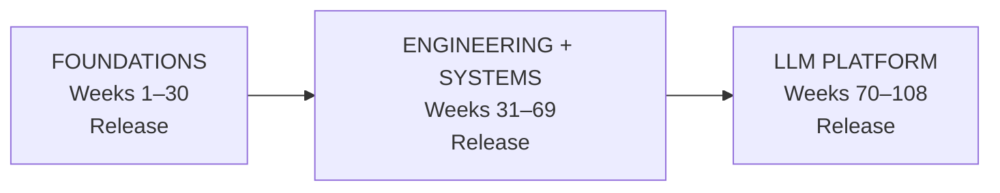

# {{ cookiecutter.repo_name }}

> **{{ cookiecutter.course_name }}**

**Student:** {{ cookiecutter.student_name }}
**GitHub:** [@{{ cookiecutter.github_username }}](https://github.com/{{ cookiecutter.github_username }})
**Start date:** {{ cookiecutter.start_date }} (Monday of Week 1)
**Effort:** {{ cookiecutter.effort_hours_per_week }} hours/week
**Track:** {{ cookiecutter.track }}

This is the learner journal for the **Tensor-to-Tenant** course -- a 108-week journey from linear algebra to multi-tenant production AI platforms.

## The apprenticeship model

This repo is a 108-instructional-week apprenticeship with valuable stopping
points, not an all-or-nothing attendance challenge. It has three stackable
programs:

| Program | Weeks | Portfolio release | Evidence badge |
|---|---:|---|---|
| **Foundations** | 1-30 | Math, numerical routines, and experimentation toolkit | Gate 3 + core evidence |
| **Engineering + Systems** | 31-69 | Tested primitives, system designs, MLOps tools, and postmortem | Gate 6 + core evidence |
| **LLM Platform** | 70-108 | LLM/RAG work, inference benchmark, platform layer, and capstone | Gate 10 + core evidence |



Every week has a required **core deliverable** and an optional **depth lane**.
Core keeps the path viable in a normal week; depth is where you add proofs,
from-scratch implementations, benchmarks, failure analysis, and production
trade-offs. The generated evidence folders track implementation, benchmark or
result, technical explanation, and retrospective rather than attendance.

Milestone gates are blocking. A failed gate pauses new gate-dependent content
until targeted remediation evidence is complete. Recovery windows are planned
after Weeks 6, 14, 22, 30, 38, 46, 54, 62, 70, 78, 86, 94, and 102.

The parallel **Algorithmic Forge** runs every Friday:

| Tier | Treatment |
|---|---|
| Core | Implement and explain the phase-aligned drill |
| Supporting | Guided lab when relevant |
| Archive | Reference-only, no scheduled obligation |
| Boss fight | Selected gate or capstone extension |

See `docs/algorithmic_forge.md` for the full map and `09_interview/algorithmic_forge/`
for the four artifact lanes.

The canonical **System Design track** occupies Weeks 46-57 and includes
foundations, distributed-systems patterns, technology labs, case studies, and
OOD/LLD. See `docs/system_design_track.md` and use `make design=54` to prepare a
design artifact.

The optional **Leetcode Darbar** lane targets 548 source-catalog slots. Standard
learners use selected aligned problems; the Auror track solves and explains all
548. See `docs/leetcode_darbar.md`, record progress in
`09_interview/leetcode_darbar/TRACKER.csv`, use `make darbar=42` for evidence,
and run `make auror` for the optional badge check.

## GenAI agents track

An 18-module agents specialisation (plus Module 7.5, Model Context Protocol,
and the **Project Manus** agentic UI-automation capstone) scaffolds into
`09_interview/agents/`. Open a module with `make agent=7.5` (or `make agent=18`).
See `docs/agents_track.md` for the full track.

The **bridge** in `docs/bridge.md` maps every bootcamp module to the specific
tensor-to-tenant weeks that explain why it works under the hood — so the agents
sprint and the 108-week arc are one ladder, not two courses. The ten agent
papers (ReAct, Toolformer, DSPy, LangGraph, CRAG, MCP, Generative Agents,
Reflexion, AutoGen, Kuzzu) are assigned to the Weeks 73–81 journals that
explain them.

## Tool recommendation systems (optional parallel deep-dive)

The recommender track runs alongside Forge, Darbar, and Agents. Read
`09_interview/recommender/SEARCH.md` first for Level 2 recommendation math,
then `SNOWFLAKE.md` for the Level 3 production implementation. Use
`progress.md` for the 41 section checkboxes and record the failure mode and
metric each signal needs in production; optional exercises live in the
`exercises/` directory. `make status` reports its completion percentage.

Coming in without programming comfort? `docs/prerequisites.md` is the optional
36-week on-ramp: nine resources in order (CS50x, Nand to Tetris, MIT 6.042J,
Statistical Learning, and more). `docs/mandala.md` is the 16-mandala identity
ladder the course is built around.

## Layout

```text
.
├── docs/                              # course map, programs, gates, remediation
│   ├── programs.md                    # stackable program checkpoints
│   ├── recovery_weeks.md              # recovery-window policy
│   ├── prerequisites.md               # optional 36-week on-ramp
│   ├── agents_track.md                # GenAI agents track (Modules 1-18 + MCP)
│   ├── bridge.md                      # agents-bootcamp to arc bridge
│   ├── mandala.md                     # 16-mandala identity ladder
│   └── remediation/                   # one repair plan per gate
├── evidence/weeks/                    # implementation/result/explanation/retro
├── journal/
│   ├── TEMPLATE.md                    # canonical weekly template
│   ├── RETRO_TEMPLATE.md              # canonical retro template
│   ├── weeks/                         # week_001.md ... week_108.md
│   └── recovery/                      # recovery windows
├── 00_orientation/                    # Weeks 1-6
├── 01_math/                           # Weeks 7-30 (math foundations)
├── 02_engineering_primitives/         # Weeks 31-45
├── 03_system_design/                  # Weeks 46-57
├── 04_ml_systems/                     # Weeks 58-69
├── 05_llm/                            # Weeks 70-81
├── 06_inference/                      # Weeks 82-93
├── 07_platform/                       # Weeks 94-102
├── 08_capstone/                       # Weeks 103-108
│   ├── manus/                          # Project Manus agentic UI automation
│   └── openrouter/                     # Capstone 3 enterprise AI gateway
├── 09_interview/                      # continuous
│   ├── system_design/                  # canonical Weeks 46-57 design + OOD track
│   ├── leetcode_darbar/                # 548-slot optional interview tracker
│   ├── algorithmic_forge/              # core, supporting, archive, boss_fights
│   ├── agents/                         # one scaffold per agents module
│   └── recommender/                     # paired SEARCH.md → SNOWFLAKE.md deep-dive
├── portfolio/                          # Weeks 30, 69, and 108 release checklists
└── scripts/                            # weekly, recovery, release, gate, progress, agents
```

## Weekly modes and time budget

Every weekly journal carries a `Mode` line that declares what kind of
deliverable to ship. This is not optional decoration; it is the difference
between a 7-hour week and a 25-hour nightmare.

| Mode | What you ship | Examples |
|---|---|---|
| `implement` | Working code you can run | LRU cache (W35), `analyze_ab_test` (W63), tenant limiter (W99) |
| `read_diagram` | A written document: design doc, trade-off note, comparison table | Two case-study design docs (W53–56), training architecture map (W74), inference cost model (W93) |
| `deploy_benchmark` | A live deployment or benchmark run on a GPU | vLLM deployment (W84), live inference dashboard (W87) |

Distribution across the 108 weeks: **69 `implement`**, **35 `read_diagram`**,
**4 `deploy_benchmark`** (Weeks 75, 84, 87, 89). The `deploy_benchmark`
weeks are the only ones that *require* GPU access; everything else is
either code or writing.

The 15-hour weekly budget splits into two non-negotiable buckets:

```text
15 hr/week total
├── 6–8.5 hr  Fixed weekly overhead
│              ├ 1–1.5  Coding drill
│              ├ 1.5–2  System design question or pattern
│              ├ 0.5–1  Behavioral story refinement
│              ├ 0.5    Technical explanation out loud
│              ├ 1–1.5  Algorithmic Forge drill
│              └ 1–1.5  Sailboat retro + journal + evidence
└── 7–9 hr   Core topic work (this week's deliverable)
```

If you skip the overhead to fit the core topic, your interview readiness
silently degrades. The Friday Forge drill and the weekly retro are both
interview preparation, even when they don't feel like it.

**When you get stuck — read [`docs/bottlenecks.md`](./docs/bottlenecks.md) before
debugging.** It documents the three most common ways learners stall (no GPU
budget at Week 84, burning 25 hours on Week 74, treating self-graded gates
as guardrails) and gives explicit self-recovery protocols that don't
require external infrastructure. Modal is the default GPU redirect for
`deploy_benchmark` weeks; the free tier covers every Phase 8 deliverable.

## Daily cadence

| Day | Slot | Purpose |
|---|---|---|
| Mon | Theory | Math / paper / concept |
| Tue | Build | Code the deliverable |
| Wed | Systems / Papers | Architecture / paper reading |
| Thu | Eval / Interview | Offline slice or interview drill |
| Fri | Algorithmic Forge + Retro | Bounded algorithm drill, then update journal and plan next week |
| Weekend | Buffer | Catch up or rest |

The Darbar lane is an optional daily queue layered over this cadence. It never
replaces the core artifact or a blocking gate.

Every week also ends with the **Sailboat retrospective** in
`docs/sailboat_retro.md`: destination, wind, anchor, rocks, boat position, and
one next heading. It is a navigation ritual inside the existing retro, not
another assignment.

## RPG layer (Tensor-to-Tenant character system)

The repo ships an optional RPG character system that wraps the course OS. The
math is real: **Ebbinghaus forgetting curve** `R(t) = exp(-t / S)` plus
**Wozniak's SuperMemo SM-2** stability updates. Concepts you stop reviewing
fade; concepts you rescue grow stronger.

**How it works.** Each weekly journal seeds three concepts (title / focus /
deliverable). The first `make status` walks `journal/weeks/`, extracts ~324
concepts, and writes `journal/memory.json`. Every character save lives at
`journal/character.json` and is git-tracked.

**The classes** are tied to the `track` cookiecutter variable:

| Track | Class title | Primary bonuses |
|---|---|---|
| `balanced` | Engineering Druid | none (generalist) |
| `production-ai-platform` | Platform Paladin | +10% PLAT, +5% JUDG |
| `llm-inference` | Inference Wizard | +10% INFER, +5% ALGO |
| `rag-agents` | Retrieval Ranger | +10% ENG, +5% WIS |

**The stats** are six attributes that grow as you ship work:

| Stat | Backing domain |
|---|---|
| `WIS` | Math foundations (Weeks 7-30) |
| `ALGO` | Algorithmic Forge + Leetcode Darbar |
| `ENG` | Engineering primitives, RAG, agents (Weeks 31-45, 70-81) |
| `INFER` | LLM inference (Weeks 82-93) |
| `PLAT` | Production AI platform (Weeks 94-102) |
| `JUDG` | System design, MLOps, behavioral (Weeks 46-57, 58-69) |

**The four battle types:**

1. **HALLWAY AMBUSH** -- triggered during `make status`. Picks the most
   at-risk concept. Self-rate recall 0-5. Rescuing a fading memory pays a
   1.5x XP multiplier; failing brings HP -5.
2. **RESURRECTION DRILL** -- triggered when 3+ concepts hit LOST
   (R < 0.10). Multi-question recovery.
3. **MANDALA BARRIER** -- triggered at mandala boundaries. One pulled
   concept per prior mandala, randomly selected. Pass to open the new
   mandala normally.
4. **WEEKLY FORGE** -- Friday drill that pulls the top-3 decaying
   concepts from the current + prior week.

**The four tiers of forgetting, in plain sight:**

| Tier | R(t) | What it means |
|---|---:|---|
| `FRESH` | > 0.70 | Recently reviewed, no ambush |
| `SETTLING` | 0.50-0.70 | Eligible if you want to review early |
| `WANING` | 0.30-0.50 | Eligible for ambush |
| `FADING` | 0.10-0.30 | Strong ambush candidate |
| `LOST` | < 0.10 | Added to Resurrection Queue |

**The XP curve.** Level `n -> n+1` costs `100n` XP. A perfect week
(core 50 + forge 25 + retro 15 + depth 30 = 120 XP) plus ambush rewards
puts the graduation learner at roughly L17 by Week 108.

**HP and streaks.** You start at HP 100. Missing a core deliverable
knocks HP -15. A recovery week restores +30 HP. Streaks track consecutive
core-deliverable weeks for the "Iron Streak" achievement (12).

**Quickstart:**

```bash
make status    # first run bootstraps character + memory; renders sheet
make log       # log this week's XP manually (interview, behavioral bonus)
make ambush=1  # trigger a hallway ambush against the most-at-risk concept
make recall    # list concepts sorted by retention (most at risk first)
make boss=18   # record a boss-fight reward (gate or capstone)
make restore   # spend a recovery week (+HP, streak preserved)
```

The full reference is in `scripts/character.py` (docstrings) and
`scripts/battle.py` (battle mechanics). Every battle is reproducible from
`journal/memory.json`; every level is reproducible from `journal/character.json`.
Both files are git-tracked so your character growth is part of the portfolio.

Finish the core artifact first. Use remaining capacity for the optional depth
lane; depth work raises the ceiling but does not decide whether the week counts.

## Quickstart

```bash
make init          # create venv, install deps
make status        # render the RPG character sheet (boots memory DB on first run)
make journal       # open this week's journal entry
make week=14       # prepare/open a specific week and evidence scaffold
make recovery=14   # prepare a recovery plan after Week 14
make remediate=18  # prepare a targeted plan for Gate 18
make release=30    # prepare the Foundations release checklist
make badge=30      # verify evidence and award the Foundations badge when eligible
make forge=57      # prepare the Week 57 Algorithmic Forge artifact
make design=54     # prepare a Week 54 system-design artifact
make darbar=42     # prepare Darbar problem 42 evidence
make agent=7.5     # open the Module 7.5 (MCP) agents scaffold
make auror         # verify all 548 Darbar tracker rows are solved
make progress      # print weekly completion dashboard
make gate          # run the current milestone gate checker
make ambush=1      # trigger a hallway recall ambush (forgetting-curve simulation)
make recall        # list concepts sorted by current retention
make boss=18       # record a gate/capstone boss-fight reward
make restore       # spend a recovery week (+30 HP)
make ask p="..."   # ask the OpenRouter-backed learning partner a socratic question
make quiz          # quiz driven by FADING/LOST concepts in the RPG memory DB
make review        # walk this week's journal with the partner
make plan          # next 4 weeks anchored on the next gate
make debug p="..." # minimal-hint diagnostic help
make test          # pytest across engineering primitives
```

## RPG layer

The repo boots an RPG character system on first `make status`. Math is real
(Ebbinghaus forgetting curve + Wozniak SM-2 stability updates). Concepts you
stop reviewing fade through `FRESH -> SETTLING -> WANING -> FADING -> LOST`,
and the **Hallway Ambush** triggers whenever a concept crosses WANING.

See **RPG layer (Tensor-to-Tenant character system)** above for classes, stats,
battle types, and the XP curve. Saves live in `journal/character.json` and
`journal/memory.json` and are git-tracked.

## Learning partner (`AGENTS.md`)

An AI learning partner ships with every repo. The full role spec is in
[`AGENTS.md`](./AGENTS.md); the CLI is `scripts/learning_partner.py`. It
talks to an OpenRouter-compatible API and uses the journal + RPG state as
context. The default model is `deepseek/deepseek-v4-flash-20260731`,
configurable via `OPENROUTER_MODEL` env var.

**Five modes, all socratic by default** (the partner asks more than it
types):

```bash
make ask p="why can't exact global mode be merged from local winners?"
make quiz                  # drills driven by FADING/LOST concepts
make review                # walk this week's journal
make plan                  # next 4 weeks anchored on the next gate
make debug p="my Mo's algo gives wrong top error tool on week 14"
```

Setup:

```bash
export OPENROUTER_API_KEY=sk-or-v1-...
export OPENROUTER_MODEL="deepseek/deepseek-v4-flash-20260731"
# optional: export OPENROUTER_BASE_URL=https://openrouter.ai/api/v1
```

To swap the model entirely (Claude, GPT-4o, Llama, whatever OpenRouter
exposes), change `OPENROUTER_MODEL` -- no code changes needed.

The partner has five modes and five anti-patterns. Read `AGENTS.md` for the
role spec and the failure modes the partner refuses to fall into.


## Capstone

Weeks 103-108 offer three coherent paths:

- **Capstone 1:** Multi-Tenant LLM Trace Forensics with Mo's Algorithm
- **Capstone 2:** optional Agent Execution Forensics with Euler Tour + DSU on Tree
- **Capstone 3:** OpenRouter-inspired Enterprise Multi-Model AI Gateway

The gateway path designs and builds unified API normalization, provider
registry, policy-aware routing, stream-safe failover, enterprise tenancy,
per-tenant admission, cost attribution, and observability. See your course
bundle's `CAPSTONE3_OPENROUTER.md` for the full requirements and rubric. The
scaffold in `08_capstone/openrouter/` is ready for the design, simulator,
benchmarks, and staff-defense evidence.

## License

Apache 2.0 -- same as the parent course.
