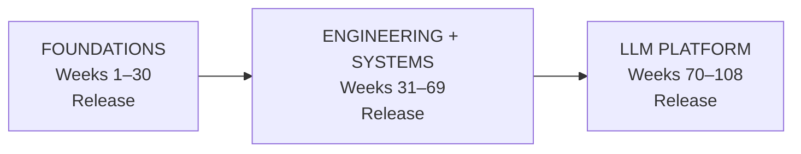

# {{ cookiecutter.repo_name }}

> **{{ cookiecutter.course_name }}**

**Student:** {{ cookiecutter.student_name }}
**GitHub:** [@{{ cookiecutter.github_username }}](https://github.com/{{ cookiecutter.github_username }})
**Start date:** {{ cookiecutter.start_date }} (Monday of Week 1)
**Effort:** {{ cookiecutter.effort_hours_per_week }} hours/week
**Track:** {{ cookiecutter.track }}

This is the learner journal for the **Tensor-to-Tenant** course -- a 108-week journey from linear algebra to multi-tenant production AI platforms.

## The apprenticeship model

This repo is a 108-instructional-week apprenticeship with valuable stopping
points, not an all-or-nothing attendance challenge. It has three stackable
programs:

| Program | Weeks | Portfolio release | Evidence badge |
|---|---:|---|---|
| **Foundations** | 1-30 | Math, numerical routines, and experimentation toolkit | Gate 3 + core evidence |
| **Engineering + Systems** | 31-69 | Tested primitives, system designs, MLOps tools, and postmortem | Gate 6 + core evidence |
| **LLM Platform** | 70-108 | LLM/RAG work, inference benchmark, platform layer, and capstone | Gate 10 + core evidence |



Every week has a required **core deliverable** and an optional **depth lane**.
Core keeps the path viable in a normal week; depth is where you add proofs,
from-scratch implementations, benchmarks, failure analysis, and production
trade-offs. The generated evidence folders track implementation, benchmark or
result, technical explanation, and retrospective rather than attendance.

Milestone gates are blocking. A failed gate pauses new gate-dependent content
until targeted remediation evidence is complete. Recovery windows are planned
after Weeks 6, 14, 22, 30, 38, 46, 54, 62, 70, 78, 86, 94, and 102.

The parallel **Algorithmic Forge** runs every Friday:

| Tier | Treatment |
|---|---|
| Core | Implement and explain the phase-aligned drill |
| Supporting | Guided lab when relevant |
| Archive | Reference-only, no scheduled obligation |
| Boss fight | Selected gate or capstone extension |

See `docs/algorithmic_forge.md` for the full map and `09_interview/algorithmic_forge/`
for the four artifact lanes.

The canonical **System Design track** occupies Weeks 46-57 and includes
foundations, distributed-systems patterns, technology labs, case studies, and
OOD/LLD. See `docs/system_design_track.md` and use `make design=54` to prepare a
design artifact.

The optional **Leetcode Darbar** lane targets 548 source-catalog slots. Standard
learners use selected aligned problems; the Auror track solves and explains all
548. See `docs/leetcode_darbar.md`, record progress in
`09_interview/leetcode_darbar/TRACKER.csv`, use `make darbar=42` for evidence,
and run `make auror` for the optional badge check.

## Layout

```text
.
├── docs/                              # course map, programs, gates, remediation
│   ├── programs.md                    # stackable program checkpoints
│   ├── recovery_weeks.md              # recovery-window policy
│   └── remediation/                   # one repair plan per gate
├── evidence/weeks/                    # implementation/result/explanation/retro
├── journal/
│   ├── TEMPLATE.md                    # canonical weekly template
│   ├── RETRO_TEMPLATE.md              # canonical retro template
│   ├── weeks/                         # week_001.md ... week_108.md
│   └── recovery/                      # recovery windows
├── 00_orientation/                    # Weeks 1-6
├── 01_math/                           # Weeks 7-30 (math foundations)
├── 02_engineering_primitives/         # Weeks 31-45
├── 03_system_design/                  # Weeks 46-57
├── 04_ml_systems/                     # Weeks 58-69
├── 05_llm/                            # Weeks 70-81
├── 06_inference/                      # Weeks 82-93
├── 07_platform/                       # Weeks 94-102
├── 08_capstone/                       # Weeks 103-108
├── 09_interview/                      # continuous
│   ├── system_design/                  # canonical Weeks 46-57 design + OOD track
│   ├── leetcode_darbar/                # 548-slot optional interview tracker
│   └── algorithmic_forge/              # core, supporting, archive, boss_fights
├── portfolio/                          # Weeks 30, 69, and 108 release checklists
└── scripts/                            # weekly, recovery, release, gate, progress
```

## Daily cadence

| Day | Slot | Purpose |
|---|---|---|
| Mon | Theory | Math / paper / concept |
| Tue | Build | Code the deliverable |
| Wed | Systems / Papers | Architecture / paper reading |
| Thu | Eval / Interview | Offline slice or interview drill |
| Fri | Algorithmic Forge + Retro | Bounded algorithm drill, then update journal and plan next week |
| Weekend | Buffer | Catch up or rest |

The Darbar lane is an optional daily queue layered over this cadence. It never
replaces the core artifact or a blocking gate.

Every week also ends with the **Sailboat retrospective** in
`docs/sailboat_retro.md`: destination, wind, anchor, rocks, boat position, and
one next heading. It is a navigation ritual inside the existing retro, not
another assignment.

Finish the core artifact first. Use remaining capacity for the optional depth
lane; depth work raises the ceiling but does not decide whether the week counts.

## Quickstart

```bash
make init          # create venv, install deps
make journal       # open this week's journal entry
make week=14       # prepare/open a specific week and evidence scaffold
make recovery=14   # prepare a recovery plan after Week 14
make remediate=18  # prepare a targeted plan for Gate 18
make release=30    # prepare the Foundations release checklist
make badge=30      # verify evidence and award the Foundations badge when eligible
make forge=57      # prepare the Week 57 Algorithmic Forge artifact
make design=54     # prepare a Week 54 system-design artifact
make darbar=42     # prepare Darbar problem 42 evidence
make auror         # verify all 548 Darbar tracker rows are solved
make progress      # print weekly completion dashboard
make gate          # run the current milestone gate checker
make test          # pytest across engineering primitives
```

## Capstone

Weeks 103-108 offer three coherent paths:

- **Capstone 1:** Multi-Tenant LLM Trace Forensics with Mo's Algorithm
- **Capstone 2:** optional Agent Execution Forensics with Euler Tour + DSU on Tree
- **Capstone 3:** OpenRouter-inspired Enterprise Multi-Model AI Gateway

The gateway path designs and builds unified API normalization, provider
registry, policy-aware routing, stream-safe failover, enterprise tenancy,
per-tenant admission, cost attribution, and observability. See your course
bundle's `CAPSTONE3_OPENROUTER.md` for the full requirements and rubric. The
scaffold in `08_capstone/openrouter/` is ready for the design, simulator,
benchmarks, and staff-defense evidence.

## License

Apache 2.0 -- same as the parent course.
